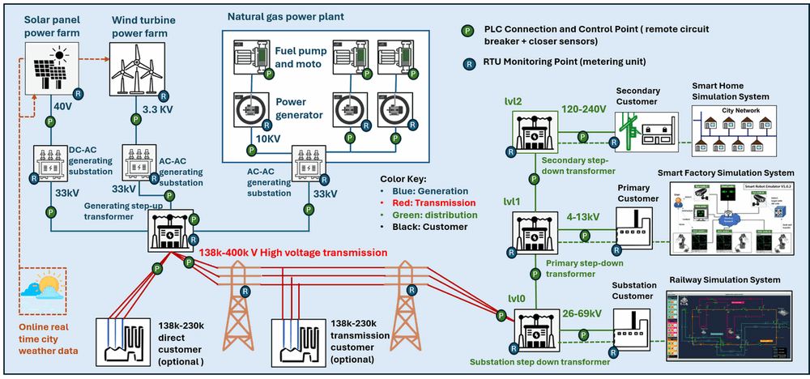
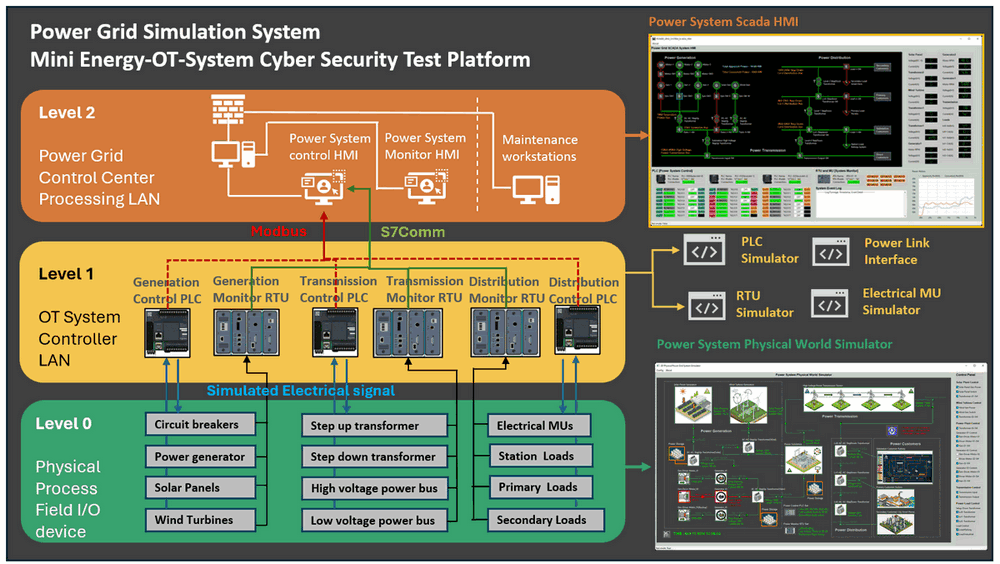
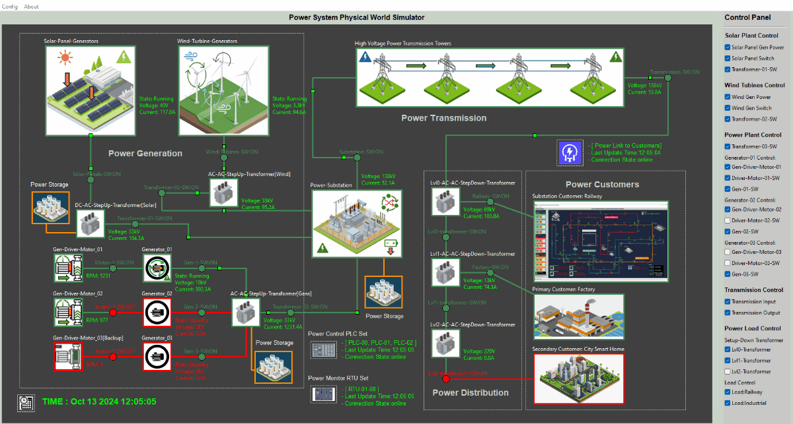
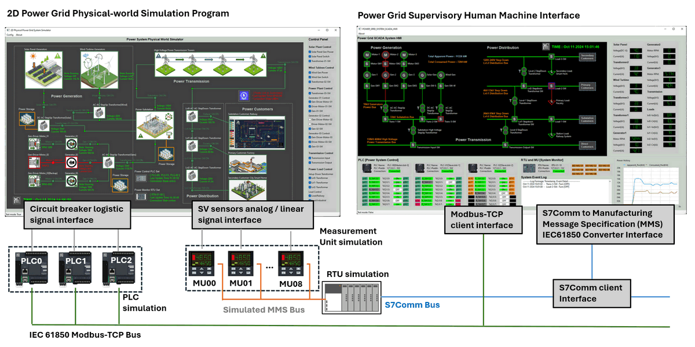
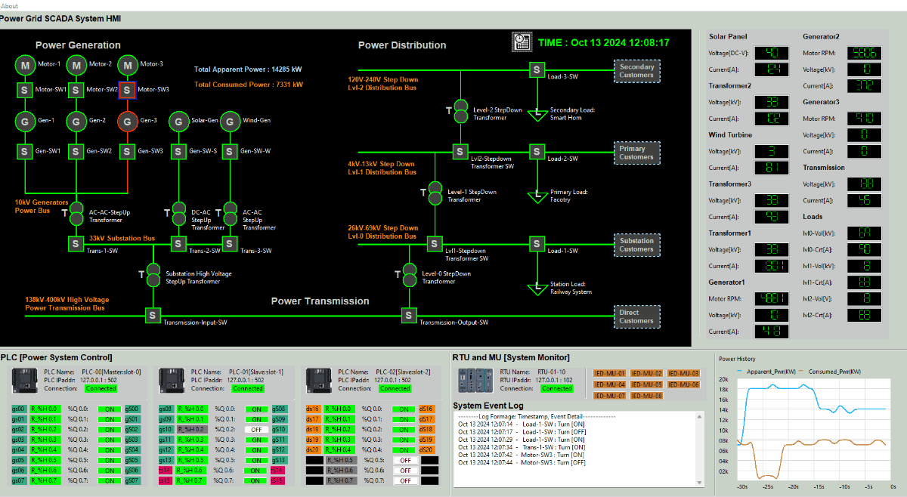

# Power_Grid_Simulation_System [System Introduction]

This document will introduce the overview of the power grid system, system structure and the detail information of the three main subsystems : `2D Power Grid Physical-world Simulation`, `Power System Controller Simulation (MU, PLC & RTU)` and 


```python
# Author:      Yuancheng Liu
# Created:     2025/02/14
# Version:     v_0.2.0
# DocNum:      Wiki_1_0
```

**Table of Contents**

[TOC]

------

### System Introduction

The **Mini OT-Energy-System Cyber Security Test Platform** is a comprehensive software platform designed to simulate the essential operations of a small-scale hybrid power grid. The key objectives of this project will cover:

- **Cybersecurity Training & Exercises**: The platform will enable hands-on cybersecurity exercises, allowing professionals to explore and mitigate the effects of various cyber-attacks on OT systems.
- **OT System Simulation**: Simulating power grid operations with components that follow the [International Electrotechnical Commission](https://iec.ch/) standards, particularly IEC 61850 (communication networks and systems for power utility automation) and IEC 60617 (graphical symbols for diagrams), ensuring adherence to industry protocols.
- **Research & Development (R&D)**: Providing a research platform to explore and develop novel cybersecurity strategies, protocols, and solutions specifically for OT systems in the energy sector.
- **Training for ICS Professionals**: Offering a realistic environment for industrial control system (ICS) professionals to enhance their understanding of OT operations and cyber-attack scenarios in a controlled, risk-free setting.
- **R&D and Testing**: Facilitating the testing of new OT security tools and protocols, as well as demonstrating the impact of cyber-attacks on critical infrastructures, such as power generation and distribution networks.

This digital twin provides a dynamic environment for simulating power generation from multiple sources, including natural gas power plants, solar farms, and wind turbine farms. It also simulates high-voltage power transmission and a three-level step-down distribution system. The system overview is shown below:



` Figure-00: Power_Grid_OT_Simulation System Overview Diagram, version v0.1.2 (2024)`

At the core of the system is a SCADA (Supervisory Control and Data Acquisition) system, which integrates key components such as Programmable Logic Controllers (PLCs), Remote Terminal Units (RTUs), and Metering Units (MUs). These components work together to enable real-time data monitoring, control, and communication, while an intuitive Human-Machine Interface (HMI) allows operators to oversee and manage grid activities. The platform follows the IEC 61850 standard for power system communications, ensuring compatibility with modern power grid structures.

The system architecture consists of three primary modules:

- **2D Visualization Program**: Simulates the physical-world devices and components of the power grid, providing a clear visual representation of grid operations.
- **OT Field Controller Simulation**: Includes simulation programs for PLCs, sensors, Metering Units (MUs), and Remote Control Units (RTUs) that enable interaction between the grid’s physical elements and the control systems.
- **SCADA-HMI System**: Provides supervisory control and real-time monitoring of the simulated power grid, allowing for detailed oversight of grid performance and operations.

Beyond replicating traditional grid functionalities, the simulation also incorporates smart grid features. This includes automated detection of unusual situations, alerts, and adaptive generation-load balancing to emulate how modern power grids respond to disruptions and maintain system equilibrium.


------

### System Structure

The simulation provides a modular, comprehensive approach to replicating real-world power generation, transmission, and distribution processes. It will integrate physical-world simulation with various control and monitoring units, including electrical metering units (MUs), programmable logic controllers (PLCs), remote terminal units (RTUs), and a SCADA-HMI interface. By offering full-spectrum emulation from Level 0 (physical field devices and sensors) to Level 2 (control center operations) as shown below, this platform creates a robust environment to simulate operational activities and vulnerabilities.

The system structure diagram is shown below:



` Figure-01: Power_Grid_OT_Simulation_System Structure Diagram, version v0.1.2 (2024)`

The platform consists of three primary components, each targeting a different level of OT system requirements:

- `OT Level 0`: A 2D simulation program representing the physical-world processes of a power grid, including energy generation from natural gas, solar, and wind sources, as well as the physical flow of electricity through transmission lines and distribution networks.
- `OT Level 1`: Simulation of power system controllers, including MU, PLC, and RTU functionalities, responsible for gathering, processing, and transmitting data from field devices to supervisory systems.
- `OT Level 2`: A fully integrated SCADA-HMI system that provides real-time visualization, monitoring, and control of the simulated power grid, ensuring seamless interaction with the OT environment.


------

### 2D Power Grid Physical-world Simulation Introduction

The **Physical-world Simulator** is a 2D visualization tool designed to replicate real-world activities within a power and energy system. It simulates the flow of both data and energy across various components such as `motor driven generators`, `solar panels`, `wind turbines`, `power cables`, `energy storage units (batteries)`, `circuit breakers`, and `step-up/step-down transformers`, `138kV high-voltage transmission lines` and `power distribution networks` serving different customer voltage requirements. 

The Physical-world Simulation UI screen shot is shown below:



` Figure-02: Power Grid Simulation Physical  world simulator UI screen short, version v0.1.2 (2024)`

This simulator provides several interfaces for enhanced functionality:

- **Logistic Level Signal Simulation**: Simulates voltage high/low signals for interaction with the PLC simulator, enabling control system logic testing.
- **Analog Level Signal Simulation**: Simulates linear analog signals (such as Volt, Amp, Wat and RPM) that are fed into Metering Units (MU) and RTU simulators, ensuring accurate data flow representation.
- **Weather Integration**: Interfaces with live city weather data to dynamically adjust solar and wind power generation based on real-world conditions, reflecting the impact of environmental factors on energy production.
- **Power Link Interface**: Connects to other digital equivalent systems (such as railway systems or smart factories) to share "power" status data, enabling integrated simulations across multiple digital infrastructures.

The simulator provides a highly visual and interactive environment, allowing users to observe how various components of the power grid function and interact, offering a realistic view of energy production, transmission, and distribution processes.


------

### Power System Controller Simulation (MU, PLC & RTU) Introduction

The **OT Field Controller System** plays a pivotal role in managing data and control flows between the 2D Power Grid Physical-world Simulation and the SCADA system. It automates the operation of electrical devices, gathers real-time data from the grid simulation, and relays critical information to the Human-Machine Interface (HMI) in the SCADA system. Additionally, it receives control commands from the HMI, adjusting the state of relevant components in the physical-world simulation accordingly. 

The system work flow diagram is shown below:



Key features of the controller system include:

- **PLCs and Circuit Breaker Control**: Three PLCs are connected to 23 remote-controlled circuit breakers within the Physical-world Simulator. They communicate with the HMI using the Modbus-TCP protocol (IEC 61850), allowing operators to manage grid operations in real-time.
- **Measurement Units (MU) and Sensor Data Collection**: Eight MUs are connected to 29 Sampled Value (SV) sensors that collect data from the grid. This data is processed and transmitted to a Remote Terminal Unit (RTU), following the IEC 61850 workflow (current version we use PLC to simulate the SV-IED-MMS-RTU flow).
- **RTU Data Feedback**: The RTU consolidates data from the eight MUs and sends processed information back to the HMI for monitoring and control purposes.

This simulation replicates real-world power system operations, ensuring seamless integration between control devices and grid components while allowing users to monitor and manipulate the system through an intuitive SCADA-HMI interface.


------

### Power Grid Supervisory Human Machine Interface (HMI) Introduction

The **SCADA-HMI** serves as the central interface for power grid operators, connecting to all PLC and RTU systems to enable efficient control and real-time monitoring of the power grid. It provides operators with advanced features such as double safety control mechanisms, monitoring of controller conditions, and automated balancing of energy generation and consumption. These features ensure safe, efficient, and reliable grid operations. 

The HMI UI screen shot is shown below: 



` Figure-04: Power Grid Simulation SCADA-HMI simulator UI screen short, version v0.1.2 (2024)`

The key components of the HMI include:

- **Circuit Diagram Interface**: Following the IEC 60617 standard for graphical symbols, this interface allows operators to monitor and control circuit breakers and switches across the grid.
- **Connection and Working Condition Panel**: Displays real-time operational statuses of all PLCs and RTUs, along with a log panel for reviewing system event history and diagnostics.
- **MU Data Panel**: Shows data collected from all metering units, providing insights into grid performance and operational parameters.
- **Load Display Panel**: Displays both current and historical data on energy generation and consumption, helping operators maintain balance within the grid.

This user-friendly HMI ensures that operators have complete visibility and control over the entire power grid system, promoting safe and effective power management.


------

> last edit by Liu Yuancheng (liu_yuan_cheng@hotmail.com) by 10/02/2025 if you have any question, please send me a message. 