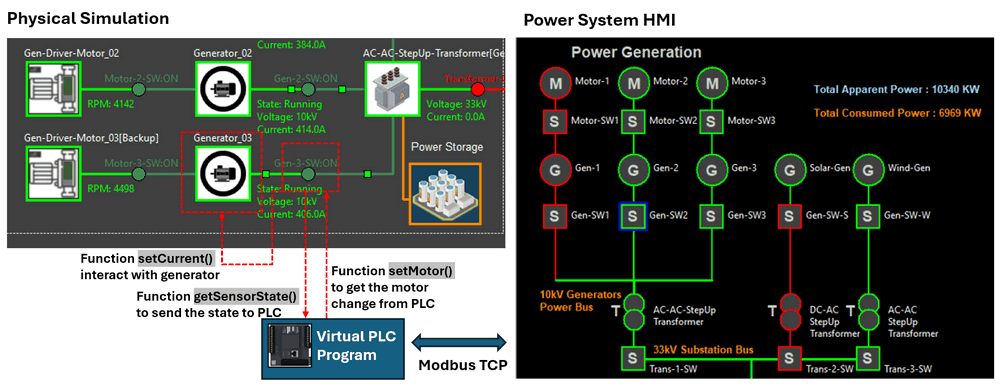

# Power_Grid_Simulation_System [System Design]

This document provides a comprehensive overview of the **Power Grid Simulation System** design. It includes detailed explanations of the following key aspects:

- **System Network Structure and Design**: The network architecture and connectivity of the simulation system.
- **Physical World Simulator Energy Flow Design**: The energy generation, transmission, and distribution processes modeled in the system.
- **PLC and Remote-Controlled Circuit Breaker Design**: The integration of programmable logic controllers (PLCs) and circuit breaker mechanisms for remote operations.
- **MU-RTU Monitoring System Design**: The configuration of Measurement Units (MUs) and Remote Terminal Units (RTUs) for real-time data monitoring and control.


```python
# Author:      Yuancheng Liu
# Created:     2025/02/11
# Version:     v_0.2.0
# DocNum:      Wiki_2_1
```

**Table of Contents**

[TOC]

------

### System Network Structure and Design

The system include 3 subnet (ICS supervision SCADA network , ICS production network and Physical world simulation network ), each sub net represent one layer of OT environment. The ICS network use IEC61850 protocol and the physical world network use UDP to simulate the electrical signal. 

The system network diagram is shown below:


` Figure-01: Power Grid Simulation System network diagram and components View, version v0.1.2 (2024)`

**Supervision SCADA Network**

A subnet simulating the `Level 2 Control Center (HQ) Processing LAN` of Energy OT environment , this subnet features distinct, SCADA data/historian servers, HMI computers for system operators, and maintenance computers dedicated to Blue team ICS/OT-system engineers.

**ICS Production Network**

This subnet host all ICS field device PLC & RTU simulator programs, contributing to a realistic representation of the production (Field Device Controllers) environment within the energy system. It will simulate the `Level 1 Controller LAN` of the OT environment.  

**Physical World Simulation Network**  

In this subnet, railway real-world components are emulated to demonstrate the tangible effects of actual physical items / device (generators, transformers, switches ...) in the real world, all the device simulation program will running in this subnet to generate the "virtual" electrical signal and feed the signal in the PLC and RTU in the production network. This network will simulate the `Level 0 Physical Process Field I/O devices` of the OT environment. 


------

### Physical World Simulator Energy Flow Design

The Physical World Simulation Program models a detailed, interactive environment that replicates the energy generation, transmission, and distribution processes within a hybrid power grid system. It features five power generation sources across three types, which feed power to a central substation. The system also incorporates power storage units to balance energy generation, ensuring consistent supply.

The simulator integrates real-time weather data to adjust the power output from renewable energy sources, such as solar panels and wind turbines, which operate based on environmental conditions. Generators powered by natural gas can be controlled via the Human-Machine Interface (HMI), allowing operators to adjust energy production as needed. Circuit breakers are placed between each component and can be manually controlled through the HMI, providing a realistic simulation of grid management.

**Solar Panel Energy Farm Design**

The Solar Energy Farm simulates multiple solar panels producing 12-48V DC with a maximum output of 120 Amps. This power is converted to 480V AC via a DC-to-AC converter, which is then stepped up to 33kV using a transformer for transmission to the substation. The solar farm includes built-in power storage to stabilize power output, adjusting generation based on system time and weather conditions. During nighttime or adverse weather (e.g., rain or cloudy skies), power output will drop accordingly.

Workflow Diagram:


**Wind Turbine Energy Farm Design**

The Wind Turbine Energy Farm simulates multiple wind generators producing 3.3kV AC with a maximum output of 100 Amps. The generated power is stepped up to 33kV using a transformer before being transmitted to the substation. Unlike the solar farm, the wind farm does not include power storage; disconnecting the turbine blades will halt power generation. Power output dynamically adjusts based on the current wind speed, as provided by the online weather data.

Workflow Diagram:


**Natural Gas Power Plant Design**

The Natural Gas Power Plant consists of three motor-driven generators (two for regular use, one as backup). Each generator outputs 10kV AC with a maximum of 200 Amps. The power is routed through an AC bus, connected to a step-up transformer (10kV to 33kV) before being transmitted to the substation. This plant includes local power storage to manage load balancing effectively.

Workflow Diagram:


**High Voltage Transmission Design**

The High Voltage Transmission system simulates the transmission of 138kV power with a 4.54% power loss rate and a maximum current of 50 Amps. It consolidates energy from all generation sources (solar, wind, and natural gas) at the power substation before transmitting it.


**Level 0 Power Distribution**

Level 0 Power Distribution is the initial stage of power delivery, converting 138kV transmission voltage to 69kV. It serves direct customers, like railway systems, and provides power to the next level of the distribution network. The maximum current is 120 Amps.


**Level 1 Power Distribution**

Level 1 Power Distribution caters to customers requiring medium voltage (13kV). The Level 1 transformer steps down 69kV to 480V-13kV, providing power to primary customers like factories. It also supplies power to the next level of the distribution network.


**Level 2 Power Distribution**

Level 2 Power Distribution simulates standard residential and commercial power supply (110V-220V AC). The Level 2 step-down transformer converts 13kV to 110V-220V, delivering power to secondary customers, such as smart homes. The maximum current is 40 Amps.

Workflow Diagram:


------

### PLC and Remote Control Circuit Breaker Design

The circuit breakers play a crucial role in managing the connection and disconnection of various power generation sources, transmission lines, and distribution networks, ensuring safe and efficient grid operations. The PLC and Remote Control Circuit Breaker design simulates the automated control of circuit breakers throughout the power grid system. Utilizing a PLC simulation program, it enables the remote control of circuit breakers, allowing operators to manage the grid effectively via SCADA systems.

The system design diagram is shown below:



` Figure-02: PLC and Remote Control Circuit Breaker Design diagram, version v0.1.2 (2024)`

The system is designed to control 23 remote circuit breakers across the power grid's generation, transmission, and distribution systems. The diagram below illustrates the layout of these circuit breakers:

**Power Generation System**

16 Circuit Breakers: Manage the flow of power from solar panels, wind turbines, and natural gas generators. Breakers control connections between power generation units, energy storage, and step-up transformers. The detail is shown below:

| Idx  | Breaker ID (Physical World / HMI) | Breaker Linked Source                       | Breaker Linked Destination                 |
| ---- | --------------------------------- | ------------------------------------------- | ------------------------------------------ |
| 1    | Solar farm charge switch          | Solar farm output                           | Solar energy storage input                 |
| 2    | Solar farm output switch          | Solar farm output                           | Solar farm DC-AC step up transformer input |
| 3    | Transformer-01-SW                 | Solar farm DC-AC step up transformer output | Power substation input                     |
| 4    | Wind gen link switch              | Wind turbine blades                         | Wind turbine generator                     |
| 5    | Wind Gen Switch                   | Wind turbine generator output               | Wind farm AC-AC step up transformer input  |
| 6    | Transformer-02-SW                 | Wind farm AC-AC step up transformer output  | Power substation input                     |
| 7    | Gen-Driver-Motor-01               | Motor-01 Fuel pump                          |                                            |
| 8    | Driver-Motor-01-SW                | Motor-01output                              | Generator-01 input                         |
| 9    | Gen-01-SW                         | Generator-01 output                         | Natural Gas Power Plant AC Bus             |
| 10   | Gen-Driver-Motor-02               | Motor-02 Fuel pump                          |                                            |
| 11   | Driver-Motor-02-SW                | Motor-02 output                             | Generator-02 input                         |
| 12   | Gen-02-SW                         | Generator-02 output                         | Natural Gas Power Plant AC Bus             |
| 13   | Gen-Driver-Motor-03               | Backup Motor Fuel pump                      |                                            |
| 14   | Driver-Motor-03-SW                | Backup Motor output                         | Backup Generator input                     |
| 15   | Gen-03-SW                         | Backup generator output                     | Natural Gas Power Plant AC Bus             |
| 16   | Transformer-03-SW                 | Natural Gas Power Plant output              | Power substation input                     |

**Power Transmission System**

2 Circuit Breakers: Control the transmission of high-voltage power from the main substation to transmission towers and further to distribution substations.

| Idx  | Breaker ID (Physical World / HMI) | Breaker Linked Source                  | Breaker Linked Destination            |
| ---- | --------------------------------- | -------------------------------------- | ------------------------------------- |
| 17   | Substation SW                     | Power substation                       | High Voltage transmission tower input |
| 18   | Transmission SW                   | High Voltage transmission tower output | Power Distribution substation input   |

**Power Distribution System**

5 Circuit Breakers: Regulate the step-down process across different voltage levels, enabling safe and controlled power distribution to various consumers, including railway systems and industrial facilities.

| Idx  | Breaker ID (Physical World / HMI) | Breaker Linked Source                | Breaker Linked Destination              |
| ---- | --------------------------------- | ------------------------------------ | --------------------------------------- |
| 19   | Lvl0-Transformer-SW               | Power Distribution substation output | Lvl0-Transformer input                  |
| 20   | Lvl1-Transformer-SW               | Lvl0-Transformer output              | Lvl1-Transformer input                  |
| 21   | Lvl2-Transformer-SW               | Lvl1-Transformer output              | Lvl2-Transformer input                  |
| 22   | Load-Railway-SW                   | Lvl0-Transformer output              | Railway system digital twin power input |
| 23   | Load-Industrial-SW                | Lvl1-Transformer output              | Smart Factory digital twin power input  |

Each circuit breaker can be manually operated via Physical world control check box, HMI or controlled automatically by PLCs, ensuring flexibility in managing power flow and responding to grid demands.


------

### MU-RTU Monitor System Design

The **MU-RTU Monitor System ** design currently utilizes S7Comm communication protocols, paired with the [HD67620-A1](https://www.adfweb.com/Home/products/IEC61850_PROFINET.asp?frompg=nav35_30) module, to simulate the IEC61850 MU-IED-RTU control sequence. Currently as we haven't find a good lib to simulate the MMS message communication well, so we temporarily use this solution to bridge the gap and in the next version we will improve this design. The following diagram provides an overview of the system structure:


` Figure-03: MU-RTU Monitor System Design diagram, version v0.1.2 (2024)`

The **SV (Sampled Values) metering units** (MUs) are responsible for collecting and monitoring data from various components throughout the power grid. Each MU detects specific parameters, including:

- **Work State:** Indicates the current operational state (e.g., running, idle, error).
- **Power Output State:** Monitors electrical parameters such as voltage and current.
- **Special State Indicators:** Tracks unique metrics, such as motor RPM or battery charge percentage.

In the program we also implemented the convertor interface in the HMI part and the data flow diagram (we will improve this design in the next version) is shown below: 


` Figure-08: MU-RTU Monitor System data flow diagram, version v0.1.2 (2024)`

A total of 20 Measurement Units (MUs) are integrated within the system, spanning the power generation, transmission, and distribution sections of the grid. Each unit is linked to specific components to provide comprehensive monitoring:

**Power Generation System:**

| Idx  | MU Set ID              | Sensor Num | Connected Components            | Metering Data                                    |
| ---- | ---------------------- | ---------- | ------------------------------- | ------------------------------------------------ |
| 1    | Solar Farm MU          | 3          | Solar Panel                     | Work State, Voltage, Current                     |
| 2    | Solar Storage MU       | 2          | Solar Power Storage Battery     | Battery Charge/Release, Battery Percentage       |
| 3    | Transformer-01-MU      | 3          | Solar Step-Up Transformer       | Work State, Voltage, Current                     |
| 4    | Wind Farm MU           | 4          | Wind Turbine                    | Work State, Turbine Blade RPM, Voltage, Current  |
| 5    | Transformer-02-MU      | 3          | Wind Step-Up Transformer        | Work State, Voltage, Current                     |
| 6    | Motor-01-MU            | 3          | Generator-01 Driven Motor       | Work State, Throttle Percentage, RPM             |
| 7    | Gen-01-MU              | 4          | Generator 01                    | Work State, RPM, Voltage, Current                |
| 8    | Gen-02-MU              | 4          | Generator 02                    | Work State, RPM, Voltage, Current                |
| 9    | Backup Gen-03-MU       | 4          | Backup Generator                | Work State, RPM, Voltage, Current                |
| 10   | Transformer-03-MU      | 3          | Power Plant Step-Up Transformer | Work State, Voltage, Current                     |
| 11   | Power Plant Storage MU | 2          | Power Plant Storage             | Storage Power Charge/Release, Storage Percentage |

**Power Transmission System:**

| Idx  | MU Set ID             | Sensor Num | Connected Components     | Metering Data                                                |
| ---- | --------------------- | ---------- | ------------------------ | ------------------------------------------------------------ |
| 12   | Substation MU         | 8          | Power Substation         | Work State, Input Bus Voltage/Current, Output Transmission Voltage/Current, Power Storage Voltage/Current |
| 13   | Substation Storage MU | 2          | Substation Power Storage | Storage Power Charge/Release, Storage Percentage             |
| 14   | Transmission MU       | 2          | Transmission Line        | High Voltage Transmission Voltage, Current                   |

**Power Distribution System:**

| Idx  | MU Set ID           | Sensor Num | Connected Components             | Metering Data                |
| ---- | ------------------- | ---------- | -------------------------------- | ---------------------------- |
| 15   | Lvl0-Transformer-MU | 3          | Level 0 Step-Down Transformer    | Work State, Voltage, Current |
| 16   | Station-Cus-MU      | 3          | Station Power Customer (Railway) | Work State, Voltage, Current |
| 17   | Lvl1-Transformer-MU | 3          | Level 1 Step-Down Transformer    | Work State, Voltage, Current |
| 18   | Primary-Cus-MU      | 3          | Primary Power Customer (Factory) | Work State, Voltage, Current |
| 19   | Lvl2-Transformer-MU | 3          | Level 2 Step-Down Transformer    | Work State, Voltage, Current |
| 20   | Secondary-Cus-MU    | 3          | Secondary Power Customer (Home)  | Work State, Voltage, Current |

> Future Enhancements: In the upcoming version, the design will be upgraded to include enhanced MMS communication and more robust integration between the MU, RTU, and HMI components, ensuring better interoperability and improved system performance.


------

> last edit by Liu Yuancheng (liu_yuan_cheng@hotmail.com) by 13/02/2025 if you have any question, please send me a message. 