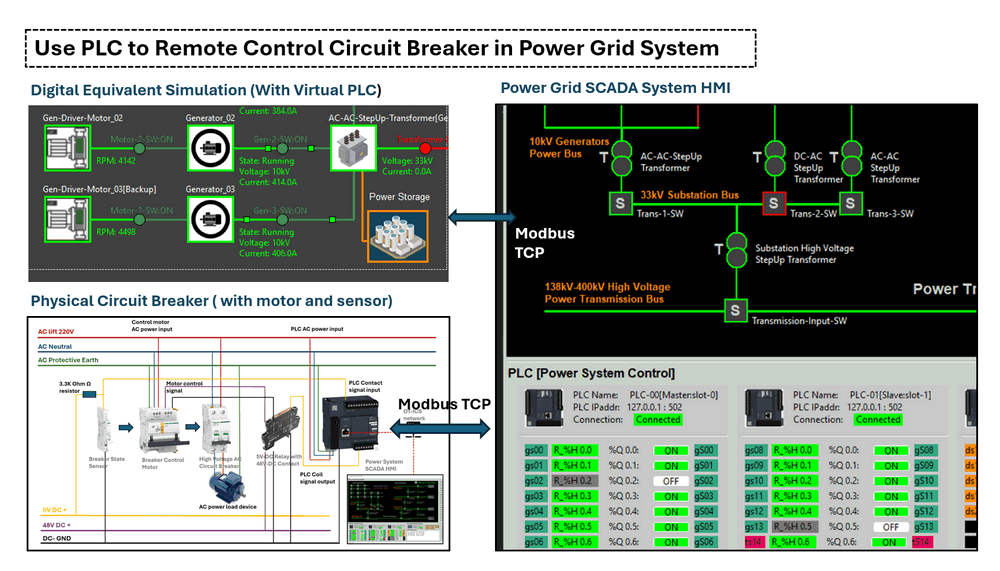

# Power_Grid_Simulation_System [ PLC Breakers Control Design ]

This document provides a detailed explanation of how the PLC control flow for circuit breakers is implemented in the **Power Grid Simulation System**. It begins by introducing the real-world application of Schneider Electric circuit breakers, sensors, closers, and PLCs, including physical hardware connections. The document also provides a step-by-step guide for designing a PLC ladder diagram to monitor and control breaker states. Finally, it explains how the process is simulated using software to replicate real-world operations.


```python
# Author:      Yuancheng Liu
# Created:     2025/02/13
# Version:     v_0.2.0
# DocNum:      Wiki_2_2
```

**Table of Contents**

[TOC]


------

### Introduction

Programmable Logic Controllers (PLC) are essential in power systems for remote monitoring and control of key equipment like circuit breakers, relay and closer. This project focuses on a practical example of using a Schneider Electric PLC to remotely control a circuit breaker, along with integrating sensors and remote control motor mechanisms. Then introduce how we use the digital equivalent software to replicate real-world operations in the **Power Grid Simulation System** project.



The project will guide through:

- **Physical device/hardware connections**: Setting up wiring between the power bus, signal link,  PLC, circuit breaker, position sensors, and control devices.
- **PLC ladder logic design**: Developing the PLC internal control logic to manage breaker states and automate operations.
- **SCADA HMI integration**: Using a power system SCADA interface to monitor and control the circuit breaker remotely.
- **Exception and alert handling**: Simulating and responding to anomalies such as power trips, breaker flip failed.
- **Digital equivalent system simulation**: Designing a digital twin of the power grid to simulate and validate the entire control process.

For the digital equivalent implement part, two subprojects will also be used for this system to simulate the OT devices and the power grid control sequence:

- **Python Virtual PLC & RTU Simulator**: A tool to simulate the PLC devices used in the system [project link](https://github.com/LiuYuancheng/Power_Grid_Simulation_System).
- **Power Grid Simulation System**: A simulation platform for emulating physical electrical devices and providing SCADA HMI functionalities for monitoring and control [project link](https://github.com/LiuYuancheng/PLC_and_RTU_Simulator).

The real world power system is much more complex than what we introduced, this comprehensive project will demonstrate the main basic idea how PLCs are used in modern power grids for safe, efficient, and reliable remote control.


------

