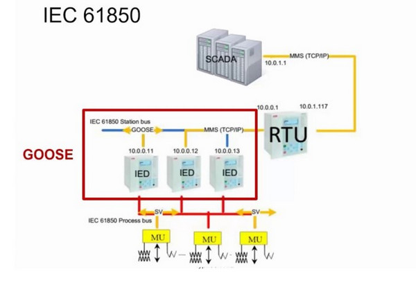

# Power_Grid_Simulation_System [ MU-IED-RTU Monitor Flow Design ]

**Project Design Purpose** : This document provides a detailed overview of the monitoring subsystem inn OT power grid simulation environment, with a focus on the MU-IED-RTU Monitor Flow Design. It examines the functions and interactions of Metering Units (MU), Intelligent Electronic Devices (IED), and Remote Terminal Units (RTU) within the state monitoring architecture of a real-world power grid. The content is organized into three main sections:

- An introduction to the core functions of MU, IED, and RTU devices, and how they work together to enable real-time monitoring and control of the grid.
- A detailed explanation of how these components are digitally replicated within our power grid simulation system. 
- A technical breakdown of the software design, communication architecture, and monitoring workflow that underpin the operation of this digital twin environment.


```python
# Author:      Yuancheng Liu
# Created:     2025/04/19
# Version:     v_0.2.0
# DocNum:      Wiki_2_2
```

**Table of Contents**

[TOC]


------

### Introduction 

In modern Operational Technology (OT)-based power grid monitoring systems, **Metering Units (MU)**, **Intelligent Electronic Devices (IED)**, and **Remote Terminal Units (RTU)** play critical roles in ensuring real-time state awareness and control. These devices are integral to digital substations that operate under the IEC 61850 standard, which defines the communication protocols and data models for substation automation.

The following diagram illustrates a simplified view of how MUs, IEDs, and RTUs interact under IEC 61850 communication architecture:



At the field level, **Metering Units (MU)** act as data acquisition interfaces that convert analog signals (such as voltage and current from electrical sensors) into digital Sampled Values (SV). These SV messages are transmitted over the **IEC 61850 Process Bus** to the IEDs.

**Intelligent Electronic Devices (IEDs)** receive these digital measurements and equipment status signals from MUs and other sources. They analyze this data to make local control decisions—such as opening circuit breakers during faults or adjusting transformer tap changers to stabilize voltage levels. Communication between IEDs occurs over the **IEC 61850 Station Bus**, using high-speed protocols like GOOSE (Generic Object-Oriented Substation Event) and MMS (Manufacturing Message Specification).

At the system integration layer, the **RTU** serves as a gateway between the IED network and upper-level OT systems like SCADA, HMI, or PLCs. It aggregates data, supports complex control logic, and facilitates long-distance communication with control centers for remote monitoring and control.

This project aims to walk through the design and simulation of a digital twin system for this architecture, covering:

- **Physical device background knowledge**: Understanding the roles and functions of MU, IED, and RTU in real-world deployments.

- **RTU internal logic design**: Developing programmable logic (e.g., using virtual PLCs) to manage breaker operations and automation.

- **SCADA HMI integration**: Implementing SCADA-based visualization and control interfaces for grid state management.

- **Exception and alert handling**: Simulating fault scenarios and implementing recovery mechanisms like automated breaker resets.

- **Digital equivalent system simulation**: Building a fully functional simulation of the control sequence and data flow in a digital substation.

To support this implementation, two open-source subprojects are used:

- [**Python Virtual PLC & RTU Simulator**](https://github.com/LiuYuancheng/Power_Grid_Simulation_System): A tool for emulating PLC/RTU logic and behavior.
- [**Power Grid Simulation System**](https://github.com/LiuYuancheng/PLC_and_RTU_Simulator): A platform that simulates power grid devices and integrates SCADA HMI functionality for testing and visualization.

------

Background knowledge of Physical Device 

This section will give a simple background knowledge view about the physical devices

What is Metering Unit?


What Intelligent electronic device ? 


What is Remote Terminal Unit  ? 


What is the difference between RTU and PLC ?  

