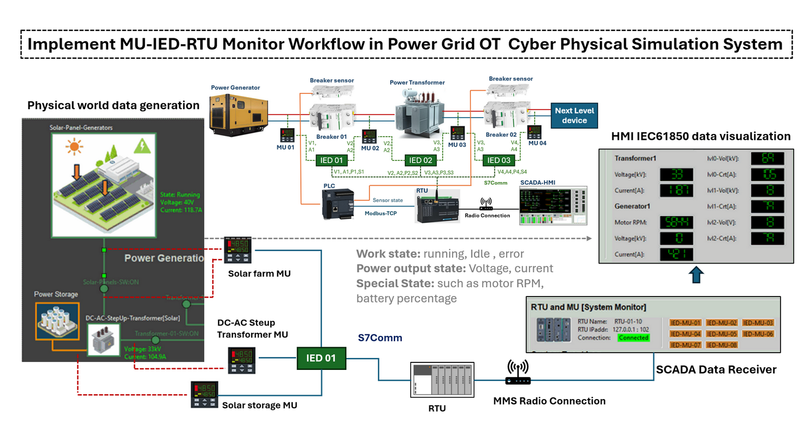
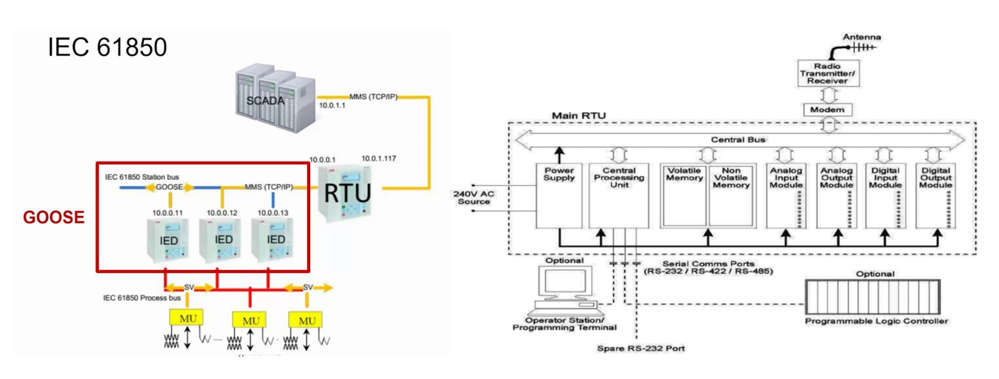
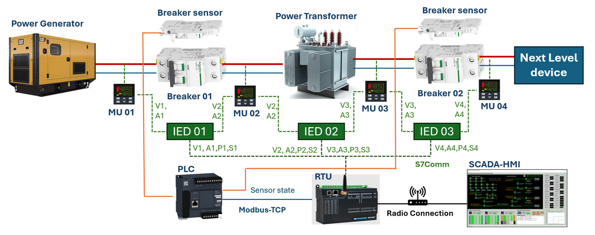
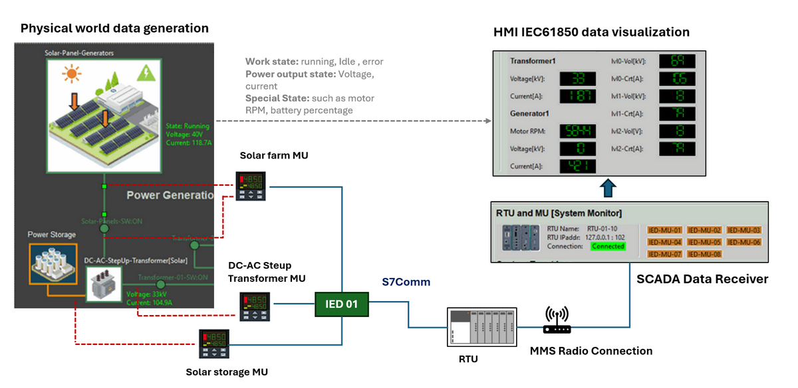
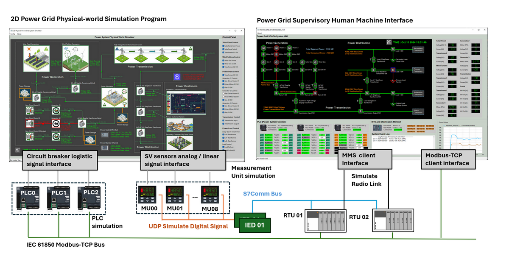

# Power_Grid_Simulation_System [ MU-IED-RTU Monitor Flow Design ]

**Project Design Purpose** : This document provides a detailed overview of the monitoring subsystem in an OT Power Grid Simulation Cyber Physical  environment, with focusing on the detail information about MU-IED-RTU Monitor Flow Design. It examines the functions and interactions of Metering Units (MU), Intelligent Electronic Devices (IED), and Remote Terminal Units (RTU) within the state monitoring architecture of a real-world energy system. The content is organized into three main sections:

- An introduction to the core functions of MU, IED, and RTU devices, and how they work together to enable real-time monitoring and control of the power grid.
- A detailed explanation of how these components are digitally replicated within our power grid simulation system. 
- A technical breakdown of the software design, communication architecture, and monitoring workflow that underpin the operation of this digital twin environment.


```python
# Author:      Yuancheng Liu
# Created:     2025/04/19
# Version:     v_0.2.0
# DocNum:      Wiki_2_2
```

**Table of Contents**

[TOC]

- [Power_Grid_Simulation_System [ MU-IED-RTU Monitor Flow Design ]](#power-grid-simulation-system---mu-ied-rtu-monitor-flow-design--)
    + [Project Introduction](#project-introduction)
    + [Background Knowledge of Physical Devices](#background-knowledge-of-physical-devices)
      - [What is a Metering Unit (MU)?](#what-is-a-metering-unit--mu--)
      - [What is an Intelligent Electronic Device (IED)?](#what-is-an-intelligent-electronic-device--ied--)
      - [What is a Remote Terminal Unit (RTU)?](#what-is-a-remote-terminal-unit--rtu--)
      - [Difference between RTU and PLC](#difference-between-rtu-and-plc)
    + [RTU Internal Logic Design](#rtu-internal-logic-design)
      - [RTU Workflow and Logic Implementation](#rtu-workflow-and-logic-implementation)
      - [RTU Safety Logic Rules Example](#rtu-safety-logic-rules-example)
      - [Communication and Integration](#communication-and-integration)
    + [Digital Equivalent System Simulation](#digital-equivalent-system-simulation)
      - [System Network Communication Detail](#system-network-communication-detail)
    + [Conclusion](#conclusion)

------

### Project Introduction 

In modern Operational Technology (OT)-based power grid monitoring systems, **Metering Units (MU)**, **Intelligent Electronic Devices (IED)**, and **Remote Terminal Units (RTU)** play critical roles in ensuring real-time state awareness and control. These devices are integral to digital substations that operate under the IEC 61850 standard, which defines the communication protocols and data models for substation automation.



` Figure-00: Project Overview Diagram, version v0.2.0 (2025)`

The following diagram illustrates a simplified view of how MUs, IEDs, and RTUs interact with each other and other OT devices under IEC 61850 communication architecture:



` Figure-01: IEC 61850 MU-IED-RTU connection diagram, version v0.2.0 (2025)`

At the field level, **Metering Units (MU)** act as data acquisition interfaces that convert analog signals (such as voltage and current from electrical sensors) into digital Sampled Values (SV). These SV messages are transmitted over the **IEC 61850 Process Bus** to the IEDs.

**Intelligent Electronic Devices (IEDs)** receive these digital measurements and equipment status signals from MUs and other sources. They analyze this data to make local control decisions—such as opening circuit breakers during faults or adjusting transformer tap changers to stabilize voltage levels. Communication between IEDs occurs over the **IEC 61850 Station Bus**, using high-speed protocols like GOOSE (Generic Object-Oriented Substation Event) and MMS (Manufacturing Message Specification).

At the system integration layer, the **RTU** serves as a gateway between the IED network and upper-level OT systems like SCADA, HMI, or PLCs. It aggregates data, supports complex control logic, and facilitates long-distance communication with control centers for remote monitoring and control.

This project aims to walk through the design and simulation of a digital twin system for this architecture, covering:

- **Physical device background knowledge**: Understanding the roles and functions of MU, IED, and RTU in real-world deployments.

- **RTU internal logic design**: Developing programmable logic to verify and manage the power circuit state, operations and automation.

- **SCADA HMI integration**: Implementing SCADA-based visualization and control interfaces for grid state management.

- **Exception and alert handling**: Simulating fault scenarios and implementing recovery mechanisms like automated breaker resets.

- **Digital equivalent system simulation**: Building a fully functional simulation of the control sequence and data flow in a digital substation.

To support this implementation, two open-source subprojects are used:

- [**Python Virtual PLC & RTU Simulator**](https://github.com/LiuYuancheng/Power_Grid_Simulation_System): A tool for emulating PLC/RTU logic and behavior.
- [**Power Grid Simulation System**](https://github.com/LiuYuancheng/PLC_and_RTU_Simulator): A platform that simulates power grid devices and integrates SCADA HMI functionality for testing and visualization.


------

### Background Knowledge of Physical Devices

This section provides a foundational understanding of the core physical devices used in the power grid monitoring system: **Metering Units (MU)**, **Intelligent Electronic Devices (IED)**, and **Remote Terminal Units (RTU)**. It also highlights the differences between RTUs and Programmable Logic Controllers (PLC), which are often used together in OT systems.


` Figure-02: IEC 61850 MU IED RTU Overview diagram, version v0.2.0 (2025)`

#### What is a Metering Unit (MU)?

A **power grid metering unit (MU)** is a critical device in electrical systems designed to measure, record, and communicate real-time electrical parameters such as voltage, current, power, frequency, and energy consumption across a power grid. Functioning as the "sensory layer" of the grid, MUs use high-precision sensors (e.g., current transformers, voltage transformers) to capture raw analog signals from transmission lines, substations, or distributed energy resources. These signals are then digitized and processed into standardized data formats (e.g., IEC 61850-9-2 Sampled Values) for compatibility with downstream systems.

#### What is an Intelligent Electronic Device (IED)?

An **Intelligent Electronic Device (IED)** is a microprocessor-based component in power grid systems that performs critical protection, control, and monitoring functions. IEDs receive real-time data from sensors, such as metering units (MUs), and process it to execute automated decisions—like tripping circuit breakers during faults, adjusting voltage levels, or isolating grid sections. They integrate communication protocols (e.g., IEC 61850) to exchange data with Remote Terminal Units (RTUs), SCADA systems, or other IEDs, enabling coordinated grid operations. Modern IEDs also support advanced analytics for fault detection, load management, and predictive maintenance. In power grid simulations, IED logic is digitally replicated to validate control designs, ensuring seamless interaction with PLC-based breaker systems and enhancing grid reliability in dynamic scenarios.

#### What is a Remote Terminal Unit (RTU)?

A **Remote Terminal Unit (RTU)** is a ruggedized hardware device deployed in power grid systems to collect, process, and transmit data from field equipment (e.g., circuit breakers, sensors, IED, metering units) to centralized control systems like SCADA. Acting as a communication gateway, RTUs digitize analog signals, monitor equipment status (e.g., breaker positions), and execute predefined control commands (e.g., remote switching). They use industrial protocols like IEC 60870-5-101/104 or DNP3 to ensure reliable data exchange with control centers, even in harsh environments. In modern grids, RTUs often integrate with **Intelligent Electronic Devices (IEDs)** and cloud platforms, enabling real-time visibility and automated responses for grid stability. In digital twin simulations, RTU behavior is emulated to validate network latency, protocol compliance, and failover mechanisms, ensuring seamless integration with PLC-based control systems and grid-wide automation workflows.

#### Difference between RTU and PLC

A **Remote Terminal Unit (RTU)** and a **Programmable Logic Controller (PLC)** are both critical to industrial automation but serve distinct roles. An RTU specializes in remote monitoring and control across geographically dispersed systems, such as power grids, by collecting data from field devices (e.g., sensors, breakers) and transmitting it to centralized SCADA systems using protocols like DNP3 or IEC 60870-5 MMS. RTUs prioritize ruggedness, long-range communication, and low power consumption for harsh or isolated environments. In contrast, a PLC focuses on localized real-time control of machinery or processes (e.g., assembly lines, breaker logic) using ladder logic programming. PLCs excel in high-speed, deterministic operations and interface directly with sensors/actuators via industrial protocols like Modbus or PROFINET. While modern systems blur these lines—with hybrid devices integrating RTU-PLC functionalities—the core distinction remains: RTUs bridge data communication between remote sites and control centers, whereas PLCs execute automated control logic at the edge. In power grid simulations, RTUs emulate wide-area data aggregation, while PLCs model localized breaker control algorithms, highlighting their complementary roles in grid automation.

> Reference: https://galooli.com/glossary/what-is-rtu/


------

### RTU Internal Logic Design

In our digital twin power grid simulation, the Remote Terminal Unit (RTU) plays a central role in data aggregation, validation, and anomaly detection. It integrates real-time input from Metering Units (MU), Intelligent Electronic Devices (IED), and Programmable Logic Controllers (PLC) to simulate the behavior and logic of a real-world substation RTU.

The RTU is programmed to monitor the electrical flow between power sources (e.g., generators, transformers) and power consumers (e.g., breakers, next-level devices) by verifying signal consistency and detecting operational faults. As illustrated in the system diagram shown below, each power source and load point is monitored by a corresponding MU-IED pair, and the RTU orchestrates data from multiple sources for high-level decision making.



` Figure-03: Simulated Power Grid MU IED RTU connection diagram, version v0.2.0 (2025)`

#### RTU Workflow and Logic Implementation

- Metering Units (MU) collect voltage (V) and current (A) readings at both the output of power sources and the input of power loads.
- IEDs receive the MU data and compare it against preset safety thresholds. If voltage or current readings are outside safe ranges, IEDs raise local alerts.
- IEDs then calculate power flow values (e.g., apparent power S, real power P, energy imbalance) and send both raw sensor values and calculated data to the RTU via S7Comm protocol.
- The PLC monitors circuit breaker states (ON/OFF) and sends this digital signal to the RTU via Modbus-TCP.

#### RTU Safety Logic Rules Example

The RTU internal logic will detect and evaluate the current system working state, below is an example rule current our power grid simulation system provided:

- If the breaker is ON:
  - If `V1 - V2` ≥ *voltage drop threshold* → Raise `Transmission Line Voltage Drop Alert`
  - If `A1 - A2` ≥ *current drop threshold* → Raise `Power Leakage Alert`
- If the breaker is OFF:
  - If `V2 > 0` or `A2 > 0` → Raise `Breaker Short-Circuit Alert`
  - If `A1 > 0` → Raise `Input Link Power Leakage Alert`

This safety logic is replicated across all MU-IED pairs (MU01–MU04), enabling end-to-end monitoring from generator output to next-level device input. If any error or abnormality occurs in the simulated grid, the system can immediately pinpoint the fault location based on the alerting MU and IED.

#### Communication and Integration

The RTU seamlessly integrates:

- Sensors and breakers data via Modbus-TCP from the PLC,
- Electrical measurements and calculations via S7Comm from IEDs,
- Radio communication channel to forward processed data to the SCADA-HMI system for remote supervision and visualization.


------

### Digital Equivalent System Simulation

In our power grid simulation system, we replicate the entire data flow of a physical-world smart grid through a Digital Equivalent System Simulation. As shown in the diagrams, the simulation begins with the 2D Power Grid Physical-world Simulation Program, where sensor data—such as voltage, current, and equipment states—is generated based on simulated activities across the grid's power generation, transmission, and distribution sections. These raw sensor values are captured by Measurement Units (MUs) and converted into standardized digital values via UDP-based signal simulation.



` Figure-03: Power Grid Simulation MU IED RTU workflow diagram, version v0.2.0 (2025)`

The Measurement Units feed their data into Intelligent Electronic Devices (IEDs), which perform the first layer of validation and calculation. Verified data is then transmitted to Remote Terminal Units (RTUs) over an S7Comm bus, simulating industrial communication protocols. The RTUs handle further processing, aggregation, and relay the structured data to the Supervisory Control and Data Acquisition (SCADA) system using the Manufacturing Message Specification (MMS) protocol over a simulated radio network. Finally, the processed information is visualized on the Power Grid Supervisory Human-Machine Interface (HMI), allowing operators to monitor real-time system performance, equipment status, and grid metrics.

In the current simulation setup, the system integrates a total of **20 Measurement Units (MUs)**, **8 Intelligent Electronic Devices (IEDs)**, and **2 Remote Terminal Units (RTUs)**. These components provide detailed monitoring and control across different sectors:

- **Power Generation** includes solar farms, wind farms, energy storage systems, conventional generators, and their associated transformers.
- **Power Transmission** covers substations, transmission lines, and storage facilities.
- **Power Distribution** simulates multi-level step-down transformers and customer power delivery to sectors such as industrial factories, railway stations, and residential homes.

The MU and sensor detail information is shown below:

**Power Generation System:**

| Idx  | MU Set ID              | Sensor Num | Connected Components            | Metering Data                                    |
| ---- | ---------------------- | ---------- | ------------------------------- | ------------------------------------------------ |
| 1    | Solar Farm MU          | 3          | Solar Panel                     | Work State, Voltage, Current                     |
| 2    | Solar Storage MU       | 2          | Solar Power Storage Battery     | Battery Charge/Release, Battery Percentage       |
| 3    | Transformer-01-MU      | 3          | Solar Step-Up Transformer       | Work State, Voltage, Current                     |
| 4    | Wind Farm MU           | 4          | Wind Turbine                    | Work State, Turbine Blade RPM, Voltage, Current  |
| 5    | Transformer-02-MU      | 3          | Wind Step-Up Transformer        | Work State, Voltage, Current                     |
| 6    | Motor-01-MU            | 3          | Generator-01 Driven Motor       | Work State, Throttle Percentage, RPM             |
| 7    | Gen-01-MU              | 4          | Generator 01                    | Work State, RPM, Voltage, Current                |
| 8    | Gen-02-MU              | 4          | Generator 02                    | Work State, RPM, Voltage, Current                |
| 9    | Backup Gen-03-MU       | 4          | Backup Generator                | Work State, RPM, Voltage, Current                |
| 10   | Transformer-03-MU      | 3          | Power Plant Step-Up Transformer | Work State, Voltage, Current                     |
| 11   | Power Plant Storage MU | 2          | Power Plant Storage             | Storage Power Charge/Release, Storage Percentage |

**Power Transmission System:**

| Idx  | MU Set ID             | Sensor Num | Connected Components     | Metering Data                                                |
| ---- | --------------------- | ---------- | ------------------------ | ------------------------------------------------------------ |
| 12   | Substation MU         | 8          | Power Substation         | Work State, Input Bus Voltage/Current, Output Transmission Voltage/Current, Power Storage Voltage/Current |
| 13   | Substation Storage MU | 2          | Substation Power Storage | Storage Power Charge/Release, Storage Percentage             |
| 14   | Transmission MU       | 2          | Transmission Line        | High Voltage Transmission Voltage, Current                   |

**Power Distribution System:**

| Idx  | MU Set ID              | Sensor Num | Connected Components             | Metering Data                |
| ---- | ---------------------- | ---------- | -------------------------------- | ---------------------------- |
| 15   | Lvl0-Transformer-MU    | 3          | Level 0 Step-Down Transformer    | Work State, Voltage, Current |
| 16   | Station-Customer-MU    | 3          | Station Power Customer (Railway) | Work State, Voltage, Current |
| 17   | Lvl1-Transformer-MU    | 3          | Level 1 Step-Down Transformer    | Work State, Voltage, Current |
| 18   | Primary-Customer-MU    | 3          | Primary Power Customer (Factory) | Work State, Voltage, Current |
| 19   | Lvl2-Transformer-MU    | 3          | Level 2 Step-Down Transformer    | Work State, Voltage, Current |
| 20   | Secondary-Customer- MU | 3          | Secondary Power Customer (Home)  | Work State, Voltage, Current |

#### System Network Communication Detail 

Each MU is connected to specific simulated physical components and captures detailed metrics like work state, voltage, current, RPM, storage percentage, and more, depending on the device’s nature and role in the system. The whole system network and data communication diagram is shown below:



` Figure-03: Power Grid Simulation system OT device communication diagram, version v0.2.0 (2025)`

The network topology follows a layered structure where field-level MUs and IEDs communicate upwards through RTUs to SCADA, effectively simulating a realistic IEC 61850-based Smart Grid environment. This enables comprehensive testing and visualization of normal operations, fault scenarios, and recovery processes under controlled digital conditions. For the IED to RTU S7Comm connection, this is one packet example:

```
S7 Communication
    Header: (Job)
    Parameter: (Read Var)
        Function: Read Var (0x04)
        Item count: 1
        Item [1]: (DB 1.DBX 0.0 BYTE 8)
            Variable specification: 0x12
            Length of following address specification: 10
            Syntax Id: S7ANY (0x10)
            Transport size: BYTE (2)
            Length: 8
            DB number: 1
            Area: Data blocks (DB) (0x84)
            Address: 0x000000
                .... .000 0000 0000 0000 0... = Byte Address: 0
                .... .... .... .... .... .000 = Bit Address: 0
S7 Communication
    Header: (Ack_Data)
    Parameter: (Read Var)
        Function: Read Var (0x04)
        Item count: 1
    Data
        Item [1]: (Success)
            Return code: Success (0xff)
            Transport size: BYTE/WORD/DWORD (0x04)
            Length: 8
```

Table map from IED to RTU Data block[0x84] 's memory address and 'Byte Index with the value and unit:

| Index | Metering Unit On Physical World                     | Unit | Memory Idx | Byte index | Data type |
| ----- | --------------------------------------------------- | ---- | ---------- | ---------- | --------- |
| 1     | Solar panel generator output voltage                | V    | 1          | 0          | int       |
| 2     | Solar panel generator output current                | A    | 1          | 2          | int       |
| 3     | Solar step up transformer1 output voltage           | kV   | 1          | 4          | int       |
| 4     | Solar step up transformer1 output current           | A    | 1          | 6          | int       |
| 5     | Wind Turbine generator output voltage               | kV   | 2          | 0          | int       |
| 6     | Wind Turbine generator output current               | A    | 2          | 2          | int       |
| 7     | Wind step up transformer2 output voltage            | kV   | 2          | 4          | int       |
| 8     | Wind step up transformer2 output current            | A    | 2          | 6          | int       |
| 9     | Gen-Driven motor1-RPM                               | RPM  | 3          | 0          | int       |
| 10    | Generator1 output voltage                           | kV   | 3          | 2          | int       |
| 11    | Generator1 output current                           | A    | 3          | 4          | int       |
| 12    | Power storage 1 battery charging state              | -    | 3          | 6          | bool      |
| 13    | Gen-Driven motor2-RPM                               | RPM  | 4          | 0          | int       |
| 14    | Generator2 output voltage                           | kV   | 4          | 2          | int       |
| 15    | Generator2 output current                           | A    | 4          | 4          | int       |
| 16    | Power storage 2 battery charging state              | -    | 4          | 6          | bool      |
| 17    | Gen-Driven motor3-RPM                               | RPM  | 5          | 0          | int       |
| 18    | Generator 3 (backup) output voltage                 | kV   | 5          | 2          | int       |
| 19    | Generator 3 (backup) output current                 | A    | 5          | 4          | int       |
| 20    | Power storage 3 battery charging state              | -    | 5          | 6          | bool      |
| 21    | Substation to transmission tower output voltage     | kV   | 6          | 0          | int       |
| 22    | Substation to transmission tower output current     | A    | 6          | 2          | int       |
| 23    | Transmission tower to distribution input voltage    | kV   | 6          | 4          | int       |
| 24    | Transmission tower to distribution input current    | A    | 6          | 6          | int       |
| 25    | Step up transformer3 output voltage                 | kV   | 7          | 0          | int       |
| 26    | Step up transformer4 output voltage                 | A    | 7          | 2          | int       |
| 27    | Level 0 step down transformer to railway  voltage   | kV   | 7          | 4          | int       |
| 28    | Level 0 step down transformer to railway  current   | A    | 7          | 6          | int       |
| 29    | Level 1 step down transformer to factor voltage     | kV   | 8          | 0          | int       |
| 30    | Level 1 step down transformer to factor current     | A    | 8          | 2          | int       |
| 31    | Level 2 step down transformer to smart home voltage | V    | 8          | 4          | int       |
| 32    | Level 2 step down transformer to smart home current | A    | 8          | 6          | int       |


------

### Conclusion

The Power Grid Simulation System: MU-IED-RTU Monitor Flow Design document presents a detailed overview of the monitoring architecture within an OT-based digital twin power grid environment. It explains the roles and interactions of Metering Units (MUs), Intelligent Electronic Devices (IEDs), and Remote Terminal Units (RTUs) in real-time grid monitoring and control, following IEC 61850 standards. The document covers the digital replication of physical devices, the internal logic design of RTUs for anomaly detection, and the end-to-end communication workflow that integrates PLCs, SCADA systems, and field devices. Through a comprehensive simulation involving 20 MUs, 8 IEDs, and 2 RTUs, the system models power generation, transmission, and distribution operations, enabling realistic fault handling, data aggregation, and grid state visualization.


------

> last edit by Liu Yuancheng (liu_yuan_cheng@hotmail.com) by 26/04/2025 if you have any question, please send me a message. 