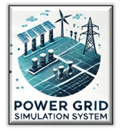
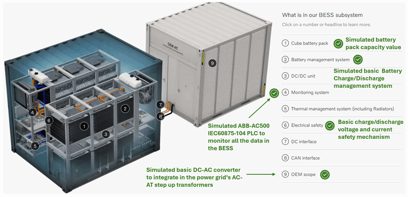
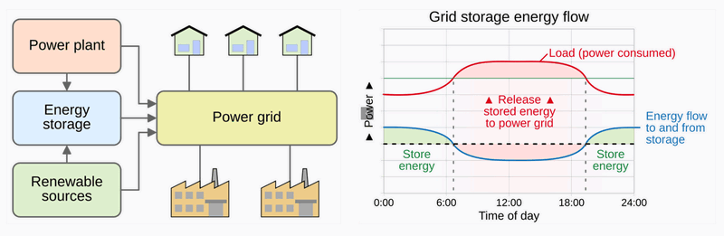
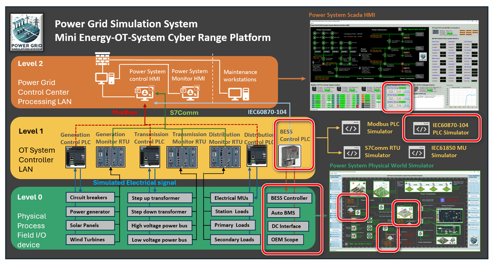
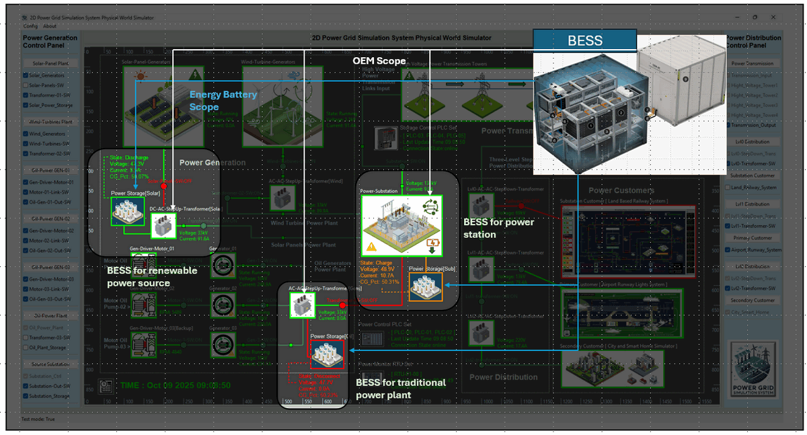
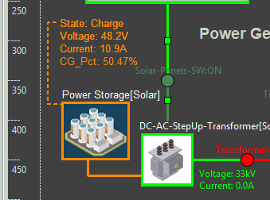
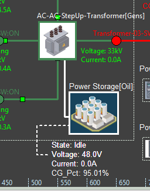
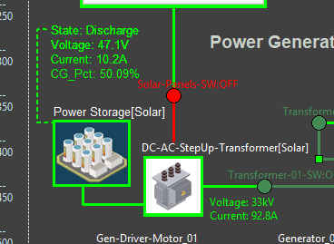
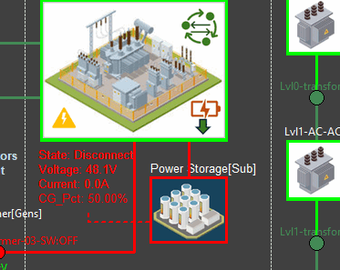

# Design of Energy Storage System In Power Grid OT Cyber Range

**Project Design Purpose** : This article introduces the design of a Battery Based Energy Storage System (BESS) within the OT Power Grid Simulation Cyber-Physical Environment that I developed. The goal is to use the software simulated realistic manageable BESS to demonstrate how large-scale energy storage supports the operation of a modern power grids.



In practice, BESS plays a vital role in balancing supply and demand by storing excess electricity from renewable energy sources such as solar and wind, and releasing it back to the grid when needed. Beyond energy balancing, BESS also provides essential services such as maintaining power supply continuity and supporting grid restart during or after outages. To make these functions tangible for cyber exercises and educational use, the project is structured into four main sections:

- **Physical BESS Simulation** – Implementation of three mid-size, 40 kWh battery energy storage stations integrated into the physical-world simulator of the power grid cyber range.
- **Electrical Devices and Energy Flow** – Modeling the electrical devices (such as battery pack, DC-DC-unit...), data collection from the battery stations, and representation of power flow control between BESS and the power grid.
- **OT Controller Design** – Using metering units and PLCs to mimic the controller layer for monitoring, battery control, and automatic management logic at each storage station.
- **Centralized Grid Control (HMI/SCADA)** – Designing a power grid operations center interface to connect to the SCADA network for monitoring and managing all energy storage stations.

This design framework highlights how battery-based storage can be realistically represented within a cyber range, making it possible to study and train on grid operations, control, and cybersecurity in a controlled simulation environment.

> **Important** : The Battery energy storage system in cyber range  will distill (**NOT** 1:1 emulate) a few OT processes from the real world and use digital constructs to represent them for the cyber exercise and education usage. In the real world the Battery energy storage systems (BESS) is much more complex. 

```python
# Author:      Yuancheng Liu
# Created:     2025/09/23
# Version:     v_0.0.1
# Copyright:   Copyright (c) 2025 Liu Yuancheng
# License:     GNU General Public License V3
```

Table of Contents

[TOC]

------

### Introduction

The **Battery Energy Storage System (BESS)** introduced in this work is a newly developed subsystem of the [**Power Grid Simulation OT Cyber Range**](https://www.linkedin.com/pulse/power-grid-ot-simulation-system-yuancheng-liu-dpplc) (**Version 2.0**). It is designed as part of the **power generation stage** of the simulated grid, enhancing overall reliability, capacity, and resilience through dynamic energy storage and delivery mechanisms. 

Within this system, three mid-size 40 kWh BESS stations have been developed and integrated with different power collection nodes — including the main output transformers of a solar power plant, an oil-based power plant, and a substation — collectively supporting up to 185 kWh (maximum) of simulated power generation capacity.

As a simulation platform, the goal is **not** to replicate a full-scale industrial BESS in all its complexity, but rather to model selected core components and basic operational behaviors that generate realistic data and interactions representative of a real system. The simulated subsystems are inspired by the concept and idea of industrial solutions from [**Volvo Penta**](https://www.volvopenta.com/industrial/battery-energy-storage/?utm_source=google&utm_medium=cpc&utm_campaign=SI_search-BESS_phrase&utm_content=&gad_source=1&gad_campaignid=21901328062&gbraid=0AAAAAozWkbnoHn2eJuiAvLdXR6sbNBpPl&gclid=CjwKCAjwisnGBhAXEiwA0zEORzkOMW7mcfFOm7rkM_-W0W2QGQlL_xZUvZFt8RrahJO9xDbDRgVnWhoCnwwQAvD_BwE), and focus on the essential part of structural and functional layers of a BESS (as illustrated below).



The simulated BESS system spans multiple layers of the Operational Technology (OT) environment, from Level 0 physical process devices to Level 2 grid SCADA control systems. The following table summarizes the major subsystems and their simulated functions show in the figure-01 : 

| BESS Subsystem                | Simulated Function/data                                      | OT Env Level |
| ----------------------------- | ------------------------------------------------------------ | ------------ |
| [1] Cube battery pack         | Defines battery pack capacity values (kWh, %)                | Level 0      |
| [2] Battery management system | Simulates automated charge/discharge control sequences managed via PLC | Level 0–1    |
| [4] Monitoring System         | Simulate the charge/discharge, volage, current safety control in PLC level and the alarm visualization in HMI level | Level 0–2    |
| [5] Electrical safety         | Simulates charge/discharge voltage–current protection logic and alarm visualization | Level 1–2    |
| [7] DC interface              | Represents 48 V DC power transmission between the battery system and collection node | level 0      |
| [9] OEM Scope                 | Simulates a basic DC–AC converter integrated into the plant’s AC–AC step-up transformer | level 0      |

#### Application in Cyber Exercises

As we introduced in the Project Design Purpose section, the integration of BESS significantly enhances the **realism and training value** of the Power Grid OT Cyber Range, all the design serves for the application in educational, cyber event, training and research. 

In cyber exercises, the simulated BESS plays dual roles — both as a red team target system and as a blue team resilience mechanism during cyber incidents. For instance, during a red-team attack scenario that triggers a simulated power outage, the BESS subsystem can automatically supply backup power for a limited duration. This feature allows the blue team to perform real-time incident response , they need to follow the pre-set emergency handling plan to prevent the attack and restore system stability before the stored energy is depleted. Such dynamic interactions help participants understand the operational importance of BESS within modern grid defense and recovery strategies.


------

### Background: Energy Storage Systems (ESS) in the Power Grid

Before delving into the technical design of the simulated BESS, it is important to understand the broader concept of **Energy Storage Systems (ESS)** within real-world power grids. The diagram below from [Wikipedia](https://en.wikipedia.org/wiki/Grid_energy_storage) illustrates the fundamental energy flow and key functional roles of ESS.



An **Energy Storage System (ESS)** is a critical component in modern power grid systems, designed to store excess electrical energy and release it when needed. ESS plays a vital role in balancing supply and demand, improving grid stability, and enabling the integration of renewable energy sources such as solar and wind, which are inherently intermittent.

By storing surplus energy during periods of low demand or high renewable generation, and discharging it during peak demand or supply shortages, ESS enhances the **reliability, flexibility, and resilience** of the grid. Different technologies are used in ESS, including **batteries (lithium-ion, flow batteries, lead-acid)**, **mechanical storage (pumped hydro, flywheels, compressed air)**, and **thermal storage**.

Key functions of ESS in the power grid include:

- **Peak Shaving & Load Leveling** – Reducing stress on generation and transmission during high-demand periods.
- **Frequency & Voltage Regulation** – Providing fast-response services to maintain grid stability.
- **Renewable Integration** – Storing excess renewable energy for use during low-generation periods.
- **Backup Power & Resilience** – Ensuring reliable supply during outages or emergencies.

As the global energy landscape shifts toward **decarbonization and smart grids**, ESS has become an enabling technology for **microgrids, smart manufacturing, hybrid power systems, and future energy markets**.


------

### BESS Architecture Overview

The architecture of the BESS within the Power Grid OT Cyber Range spans three layers of the OT environment, as illustrated below in the system architecture diagram:



**Level 0 Physical Process Field I/O  Device Layer**

At the **physical-world equipment simulation level**, the system models several key BESS components, including:

- Cube battery packs
- Battery Management System (BMS)
- Monitoring and electrical safety systems
- OEM-level connection and control scope

In the simulated configuration, each BESS is positioned adjacent to the energy collection transformer of its associated power source. The BESS shares the same DC-AC/DC-DC step-up transformer as the generators. Functionally, the BESS acts as a direct power consumer when charging and as a power generator when discharging. The modeled DC interface between the battery system and the transformer (within the OEM scope) operates at 48 V DC.

**Level 1 OT System Controller LAN** 

At the OT controller level, the system employs a PLC simulation program that emulates an [**ABB AC500 PLC**](https://new.abb.com/plc/plc-technology/ac500-plc-technical-features/ac500-connectivity/iec-60870), communicating via the IEC 60870-5-104 protocol. This setup allows the simulated controller to function as a flexible Remote Terminal Unit (RTU) within different layers of the automation architecture. The PLC autonomously manages the BESS’s charge/discharge operations based on linked transformer output, collects relevant operational data, and transmits it back to the power grid control HMI through the simulated RTU communication channel.

**Level 2 Power Grid Control Center Processing LAN**

On the SCADA-HMI side, the system provides a comprehensive visualization and control interface to display the real-time BESS information, enables manual overload and control commands with deferent gauge, indicator control buttons. It also integrates automated safety and protection mechanisms to ensure realistic grid management behavior within the cyber range environment.


------

### Physical World Simulation Design

On the physical world simulation program, we located 3 battery unit in the power grid's energy generation scope. They will connect to 3 different transformers (OEM scope) to form the BESS and represent 3 different type energy storage for the renewable source, traditional power plant and the power station. The physical GUI implement in the Power Grid Physical Simulator Module is shown below:

 

Each energy battery scop will provide the below information and auto controlled by the OEM scope's state: 

- DC interface state : Power link between battery scope to OEM scope (connected/disconnected)
- Battery charge/discharge state: battery charge, discharge or idle (fully charged), the charge/discharge. 
- Energy data: Current energy stored (KWH), battery charged presentation. 
- Time info: estimated time for battery to be fully charged or used up based on current battery state. 
- Temperature info: (under development will be implement in version 2.1 )

The DC interface state, voltage(V), current(A) and battery capacity information will update in real time next to the the battery scope.

The power grid will generate all the 4 types of state data based on current BESS and Grid Operation condition and add a random offset value to simulate the real MU reading's fluctuation. For example when the battery provide power to the grid for a while and its battery energy capacity dropped to low (10%) the output discharge voltage will drop to the range between 45V-DC to 47 V-DC. 

#### BESS Auto Management 

The are 2 BESS Auto management mechanism in the system 

Individual Auto-Control:  The BESS will automatically adjust its' state and output based on the OEM scope and the grid state. For example if the in sunny weather the solar provide 30KW power and the load only requests 21kW power, the BESS will auto switch to the charging mode to storge energy and when the weather change to raining and if the solar panel can only provide 10kW power, the BESS will auto switch to discharge mode to release power to the grid. 

Whole System auto-management: Each BESS's self auto control is implemented by the PLC directly. To make the 3 BESS can work together the data of the 3 BESS will send back to HMI side and HMI will use the 3 BESS data to do manual control adjustment to balance 3 BESS 's work load to avoid the battery over charged or discharged.

#### BESS state and manual control

Based on the management logic, on the physical world simulation UI, the BESS will show 4 type of state marked as different color as shown below: 

**BESS Charge State (Orange color)** 

|                                                  |                                                             |
| ------------------------------------------------ | ----------------------------------------------------------- |
|  | **DC Interrace**: Connected <br>**Battery state**: Charging |

UI display is shown below:


- DC Interrace: Connected
- Battery state: Charging 
- Battery capacity: < 95 %
- Voltage range: 48 V ~ 49V DC 
- Current flow : OEM scope to Battery Scope, 
- Current range : 10 ~ 20 A
- OEM energy flow: Transformer energy input > Transformer energy output

**BESS Idle State (While Color)**

UI display is shown below:



- DC Interrace: Connected
- Battery state: fully charged or used up (if no OEM scope power input)
- Battery capacity: >= 95 % or <= 10%
- Voltage range: 48 V (fully charged), 47V(battery low)
- Current flow : None
- Current range : 0 A 
- OEM energy flow:  Transformer energy input == Transformer energy output

**BESS Discharge State (Green Color)**

UI display is shown below:



- DC Interrace: Connected
- Battery state: Discharging 
- Battery capacity:  >= 10% and <= 95 % 
- Voltage range: 47 ~ 48 V 
- Current flow : Battery Scope to OEM scope to 
- Current range : 0 A 
- OEM energy flow:  Transformer energy input == Transformer energy output

**BESS Power Link Cut Off State (Red Color)**

UI display is shown below:



- DC Interrace: Disconnected 
- Battery state: Idle 
- Battery capacity:  Any
- Voltage range:  48 ~ 48.5V 
- Current flow : None
- Current range : 0 A 
- OEM energy flow:  Any


------

### Reference

- https://en.wikipedia.org/wiki/Grid_energy_storage
- https://new.abb.com/plc/plc-technology/ac500-plc-technical-features/ac500-connectivity/iec-60870
- https://www.gminsights.com/industry-analysis/energy-storage-systems-market?gad_source=1&gad_campaignid=21841937168&gbraid=0AAAAACuPGhW9A41yu679JCuOFyIOTxLRx&gclid=CjwKCAjwisnGBhAXEiwA0zEOR8s86vp5s4b601uN1anye_K9fQlpZlEQtxNF8SO68G8cOFxTQ5PdthoC8eQQAvD_BwE
- https://www.volvopenta.com/industrial/battery-energy-storage/?utm_source=google&utm_medium=cpc&utm_campaign=SI_search-BESS_phrase&utm_content=&gad_source=1&gad_campaignid=21901328062&gbraid=0AAAAAozWkbnoHn2eJuiAvLdXR6sbNBpPl&gclid=CjwKCAjwisnGBhAXEiwA0zEORzkOMW7mcfFOm7rkM_-W0W2QGQlL_xZUvZFt8RrahJO9xDbDRgVnWhoCnwwQAvD_BwE