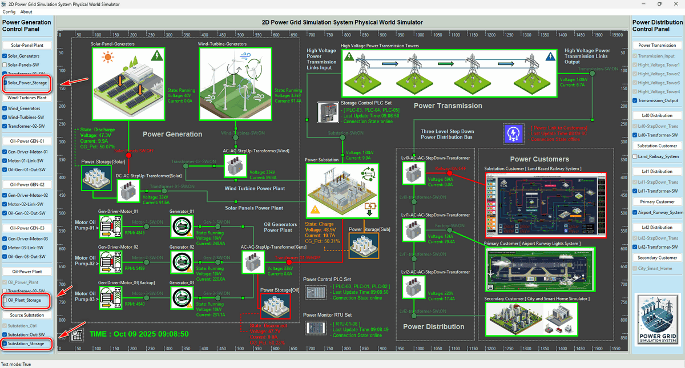
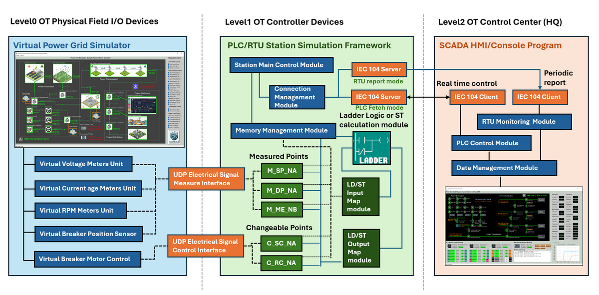

# Design of Energy Storage System In Power Grid OT Cyber Range

**Project Design Purpose** : This article introduces the design of a Battery Based Energy Storage System (BESS) within the OT Power Grid Simulation Cyber-Physical Environment that I developed. The goal is to use the software simulated realistic manageable BESS to demonstrate how large-scale energy storage supports the operation of a modern power grids.


In practice, BESS plays a vital role in balancing supply and demand by storing excess electricity from renewable energy sources such as solar and wind, and releasing it back to the grid when needed. Beyond energy balancing, BESS also provides essential services such as maintaining power supply continuity and supporting grid restart during or after outages. To make these functions tangible for cyber exercises and educational use, the project is structured into four main sections:

- **Physical BESS Simulation** – Implementation of three mid-size, 40 kWh battery energy storage stations integrated into the physical-world simulator of the power grid cyber range.
- **Electrical Devices and Energy Flow** – Modeling the electrical devices (such as battery pack, DC-DC-unit...), data collection from the battery stations, and representation of power flow control between BESS and the power grid.
- **OT Controller Design** – Using metering units and PLCs to mimic the controller layer for monitoring, battery control, and automatic management logic at each storage station.
- **Centralized Grid Control (HMI/SCADA)** – Designing a power grid operations center interface to connect to the SCADA network for monitoring and managing all energy storage stations.

This design framework highlights how battery-based storage can be realistically represented within a cyber range, making it possible to study and train on grid operations, control, and cybersecurity in a controlled simulation environment.

> **Important** : The Battery energy storage system in cyber range  will distill (**NOT** 1:1 emulate) a few OT processes from the real world and use digital constructs to represent them for the cyber exercise and education usage. In the real world the Battery energy storage systems (BESS) is much more complex. 

```python
# Author:      Yuancheng Liu
# Created:     2025/09/23
# Version:     v_0.0.1
# Copyright:   Copyright (c) 2025 Liu Yuancheng
# License:     GNU General Public License V3
```

Table of Contents

[TOC]

------

### Introduction

The **Battery Energy Storage System (BESS)** introduced in this work is a newly developed subsystem of the [**Power Grid Simulation OT Cyber Range**](https://www.linkedin.com/pulse/power-grid-ot-simulation-system-yuancheng-liu-dpplc) (**Version 2.0**). It is designed as part of the **power generation stage** of the simulated grid, enhancing overall reliability, capacity, and resilience through dynamic energy storage and delivery mechanisms. 

Within this system, three mid-size 40 kWh BESS stations have been developed and integrated with different power collection nodes — including the main output transformers of a solar power plant, an oil-based power plant, and a substation — collectively supporting up to 185 kWh (maximum) of simulated power generation capacity.

As a simulation platform, the goal is **not** to replicate a full-scale industrial BESS in all its complexity, but rather to model selected core components and basic operational behaviors that generate realistic data and interactions representative of a real system. The simulated subsystems are inspired by the concept and idea of industrial solutions from [**Volvo Penta**](https://www.volvopenta.com/industrial/battery-energy-storage/?utm_source=google&utm_medium=cpc&utm_campaign=SI_search-BESS_phrase&utm_content=&gad_source=1&gad_campaignid=21901328062&gbraid=0AAAAAozWkbnoHn2eJuiAvLdXR6sbNBpPl&gclid=CjwKCAjwisnGBhAXEiwA0zEORzkOMW7mcfFOm7rkM_-W0W2QGQlL_xZUvZFt8RrahJO9xDbDRgVnWhoCnwwQAvD_BwE), and focus on the essential part of structural and functional layers of a BESS (as illustrated below).


The simulated BESS system spans multiple layers of the Operational Technology (OT) environment, from Level 0 physical process devices to Level 2 grid SCADA control systems. The following table summarizes the major subsystems and their simulated functions show in the figure-01 : 

| BESS Subsystem                | Simulated Function/data                                      | OT Env Level |
| ----------------------------- | ------------------------------------------------------------ | ------------ |
| [1] Cube battery pack         | Defines battery pack capacity values (kWh, %)                | Level 0      |
| [2] Battery management system | Simulates automated charge/discharge control sequences managed via PLC | Level 0–1    |
| [4] Monitoring System         | Simulate the charge/discharge, volage, current safety control in PLC level and the alarm visualization in HMI level | Level 0–2    |
| [5] Electrical safety         | Simulates charge/discharge voltage–current protection logic and alarm visualization | Level 1–2    |
| [7] DC interface              | Represents 48 V DC power transmission between the battery system and collection node | level 0      |
| [9] OEM Scope                 | Simulates a basic DC–AC converter integrated into the plant’s AC–AC step-up transformer | level 0      |

#### Application in Cyber Exercises

As we introduced in the Project Design Purpose section, the integration of BESS significantly enhances the **realism and training value** of the Power Grid OT Cyber Range, all the design serves for the application in educational, cyber event, training and research. 

In cyber exercises, the simulated BESS plays dual roles — both as a red team target system and as a blue team resilience mechanism during cyber incidents. For instance, during a red-team attack scenario that triggers a simulated power outage, the BESS subsystem can automatically supply backup power for a limited duration. This feature allows the blue team to perform real-time incident response , they need to follow the pre-set emergency handling plan to prevent the attack and restore system stability before the stored energy is depleted. Such dynamic interactions help participants understand the operational importance of BESS within modern grid defense and recovery strategies.


------

### Background: Energy Storage Systems (ESS) in the Power Grid

Before delving into the technical design of the simulated BESS, it is important to understand the broader concept of **Energy Storage Systems (ESS)** within real-world power grids. The diagram below from [Wikipedia](https://en.wikipedia.org/wiki/Grid_energy_storage) illustrates the fundamental energy flow and key functional roles of ESS.


An **Energy Storage System (ESS)** is a critical component in modern power grid systems, designed to store excess electrical energy and release it when needed. ESS plays a vital role in balancing supply and demand, improving grid stability, and enabling the integration of renewable energy sources such as solar and wind, which are inherently intermittent.

By storing surplus energy during periods of low demand or high renewable generation, and discharging it during peak demand or supply shortages, ESS enhances the **reliability, flexibility, and resilience** of the grid. Different technologies are used in ESS, including **batteries (lithium-ion, flow batteries, lead-acid)**, **mechanical storage (pumped hydro, flywheels, compressed air)**, and **thermal storage**.

Key functions of ESS in the power grid include:

- **Peak Shaving & Load Leveling** – Reducing stress on generation and transmission during high-demand periods.
- **Frequency & Voltage Regulation** – Providing fast-response services to maintain grid stability.
- **Renewable Integration** – Storing excess renewable energy for use during low-generation periods.
- **Backup Power & Resilience** – Ensuring reliable supply during outages or emergencies.

As the global energy landscape shifts toward **decarbonization and smart grids**, ESS has become an enabling technology for **microgrids, smart manufacturing, hybrid power systems, and future energy markets**.


------

### BESS Architecture Overview

The architecture of the BESS within the Power Grid OT Cyber Range spans three layers of the OT environment, as illustrated below in the system architecture diagram:


**Level 0 Physical Process Field I/O  Device Layer**

At the **physical-world equipment simulation level**, the system models several key BESS components, including:

- Cube battery packs
- Battery Management System (BMS)
- Monitoring and electrical safety systems
- OEM-level connection and control scope

In the simulated configuration, each BESS is positioned adjacent to the energy collection transformer of its associated power source. The BESS shares the same DC-AC/DC-DC step-up transformer as the generators. Functionally, the BESS acts as a direct power consumer when charging and as a power generator when discharging. The modeled DC interface between the battery system and the transformer (within the OEM scope) operates at 48 V DC.

**Level 1 OT System Controller LAN** 

At the OT controller level, the system employs a PLC simulation program that emulates an [**ABB AC500 PLC**](https://new.abb.com/plc/plc-technology/ac500-plc-technical-features/ac500-connectivity/iec-60870), communicating via the IEC 60870-5-104 protocol. This setup allows the simulated controller to function as a flexible Remote Terminal Unit (RTU) within different layers of the automation architecture. The PLC autonomously manages the BESS’s charge/discharge operations based on linked transformer output, collects relevant operational data, and transmits it back to the power grid control HMI through the simulated RTU communication channel.

**Level 2 Power Grid Control Center Processing LAN**

On the SCADA-HMI side, the system provides a comprehensive visualization and control interface to display the real-time BESS information, enables manual overload and control commands with deferent gauge, indicator control buttons. It also integrates automated safety and protection mechanisms to ensure realistic grid management behavior within the cyber range environment.


------

### Physical World Simulation Design

In the Physical World Simulation Program, three Battery Units are deployed within the power grid’s energy generation scope. Each battery unit is connected to a corresponding OEM Transformer Scope, together forming the Battery Energy Storage System (BESS). These three BESS units respectively represent the three energy storage mechanisms introduced in the Background: Energy Storage Systems (ESS) in the Power Grid section:

- Renewable energy sources.
- Conventional thermal power plants.
- Power station backup systems.

The physical simulation and user interface implementation are integrated within the **Power Grid Physical Simulator Module**, as shown below:

 

#### Battery Unit Simulation Parameters

Each battery scope dynamically provides simulated parameters and operational states that are automatically governed by the corresponding OEM scope logic. The displayed and simulated data include:

- **DC Interface State:** Indicates the connection status between the battery and OEM scope (Connected / Disconnected).
- **Operation Data** : The BESS operation voltage, current and the battery voltage.

- **Battery Charge/Discharge State:** Displays the operational mode — *Charging*, *Discharging*, or *Idle (fully charged)*.

- **Energy Data:** Shows the current stored energy (kWh) and the corresponding charge percentage.

- **Time Information:** Provides the estimated time for full charge or full discharge based on the current power flow.

- **Temperature Information:** *(Under development – to be implemented in Version 2.1)*

In real time, the DC interface state, voltage (V), current (A), and capacity information are updated and displayed next to each battery scope on the GUI.

To simulate real-world conditions, the power grid module introduces data fluctuations by adding randomized offsets to the calculated values. For example, when a battery’s energy capacity falls below 10% after extended discharge, the simulated output voltage will fluctuate within 45V–47V DC, reflecting realistic Measurement Unit (MU) reading variations.

#### BESS Auto-Management Mechanisms

Two layers of automatic management are implemented within the system to ensure both local autonomy and global coordination across the energy storage subsystems.

**Individual Auto-Control**

Each BESS operates autonomously under local PLC control. It automatically adjusts its charge/discharge behavior according to the connected OEM scope’s operational state and overall grid conditions.
For instance:

- During **high solar output** (e.g., 30 kW generation with 21 kW demand), the BESS switches to **Charging Mode** to store surplus energy.

- During **low generation periods** (e.g., cloudy or rainy conditions with only 10 kW solar output), the BESS automatically enters **Discharge Mode** to supplement grid power.

**(b) Whole-System Auto-Management**

While individual BESS units perform local optimization, the HMI performs **system-level balancing**. Real-time data from all three BESS units are transmitted to the HMI, which allows operators to manually adjust control logic to maintain system stability, prevent **over-charging** or **over-discharging**, and balance the load among all BESS units.

#### BESS Auto Management 

The are 2 BESS Auto management mechanism in the system 

Individual Auto-Control:  The BESS will automatically adjust its' state and output based on the OEM scope and the grid state. For example if the in sunny weather the solar provide 30KW power and the load only requests 21kW power, the BESS will auto switch to the charging mode to storge energy and when the weather change to raining and if the solar panel can only provide 10kW power, the BESS will auto switch to discharge mode to release power to the grid. 

Whole System auto-management: Each BESS's self auto control is implemented by the PLC directly. To make the 3 BESS can work together the data of the 3 BESS will send back to HMI side and HMI will use the 3 BESS data to do manual control adjustment to balance 3 BESS 's work load to avoid the battery over charged or discharged.

#### BESS State Visualization and Manual Control

On the **Physical Simulation UI**, each BESS is visually represented with one of four distinct color-coded states to facilitate rapid status recognition and manual operation.

**BESS Charge State **

| Display UI State                                 | Parameters Value                                             |
| ------------------------------------------------ | ------------------------------------------------------------ |
|  | **DC Interface:** Connected<br>**Indicator Color**: Orange<br>**Battery State:** Charging<br>**Battery Capacity:** < 95%<br>**Voltage Range:** 48 V ~ 49 V DC<br>**Current Flow:** From OEM scope to Battery Scope<br>**Current Range:** 10 ~ 20 A<br>**Energy Flow:** Transformer Input > Transformer Output |

**BESS Idle State – White**

| Display UI State                                 | Parameters Value                                             |
| ------------------------------------------------ | ------------------------------------------------------------ |
|  | **DC Interface:** Connected<br>**Indicator Color**: White<br>**Battery State:** Fully charged or depleted (no OEM input)<br>**Battery Capacity:** ≥ 95% or ≤ 10%<br>**Voltage Range:** 47 V – 48 V<br>**Current Flow:** None (0 A)<br>**Current Range:** 0 A<br>**Energy Flow:** Transformer Input = Output |

**BESS Discharge State **

| Display UI State                                 | Parameters Value                                             |
| ------------------------------------------------ | ------------------------------------------------------------ |
|  | **DC Interface:** Connected<br>**Indicator Color**: Green<br>**Battery State:** Discharging<br>**Battery Capacity:** 10% – 95%<br>**Voltage Range:** 47 V – 48 V<br>**Current Flow:** From Battery Scope to OEM Scope<br>**Current Range:** 0 A<br>**Energy Flow:** Transformer Output exceeds Input |

**BESS Power Link Cut-Off State**

| Display UI State                                 | Parameters Value                                             |
| ------------------------------------------------ | ------------------------------------------------------------ |
|  | **DC Interface:** Disconnected<br/>**Indicator Color**: Red <br/>**Battery State:** Idle<br/>**Battery Capacity:** Any<br/>**Voltage Range:** 47 V – 48 V<br/>**Current Flow:** None (0 A)<br/>**Current Range:** 0 A<br/>**Energy Flow:** Undefined |

**Manual Overload Control**

To support manual testing and failure simulation, the interface provides a **control checkbox** that allows operators to **manually disconnect** the DC interface between a battery scope and its OEM scope as shown below : 



This feature enables testing of overload scenarios, grid isolation behavior, and BESS response verification under manual override conditions.


------

### BESS Monitor & Control — IEC-104 PLC Design

This section describes the OT-level design for monitoring and controlling the three simulated BESS units. The implementation uses the project [Python Virtual PLC Simulator with IEC-60870-5-104 Communication Protocol]( https://www.linkedin.com/pulse/python-virtual-plc-simulator-iec-60870-5-104-protocol-yuancheng-liu-bov7c) to build the PLC simulation program. 

For simplicity the current release runs **one IEC104 PLC instance** with **three memory banks** (one bank per BESS). The PLC fetches sensor/field values from the Physical World Simulator, executes local automatic control logic (ladder logic), updates physical components in the simulator, and reports measurements/controls back to the SCADA/HMI via IEC104. The system workflow diagram is shown below : 



The system will loop execute the steps in below workflow sequence: 

- **Step1** : Physical Simulator publishes battery measurements (voltage, current, SOC, DC link state, temperature).
- **Step2** : PLC reads these values from the Physical Simulator and set the related IEC-104 IOA memory.
- **Step3** : PLC ladder logic (auto/manual, interlocks, timers, hysteresis) decides on commands (charge enable, discharge enable, DC breaker open/close, alarms).
- **Step4** : PLC writes control outputs back to the IOA memory and feed back to the Physical Simulator.
- **Step5** :   PLC packages the measurement/control points as IEC104 objects (M_SP_NA_1, M_ME_NC_1, C_RC_TA_1, etc.) and exchanges them with SCADA/HMI.

#### IEC104 Memory Mapping

**Notes:**

- MP = measurement point; CP = command/changeable point.
- Use `M_SP_NA_1` for discrete states (booleans), `M_ME_NC_1` for measured analog numeric.
- CP type `C_RC_TA_1` is used for simple command steps: Auto Mode: `c104.Step.INVALID_0` , Manual  Power OFF :  `c104.Step.LOWER` , Manual  Power ON : `c104.Step.HIGHER`, Changeable Point Type: `CP`

**Solar Plant BESS IEC104 Memory Configure**

| Memory Point IOA | Point Type | Memory Point Type     | Init Val              | Physical Component          |
| ---------------- | ---------- | --------------------- | --------------------- | --------------------------- |
| 01               | MP         | `c104.Type.M_SP_NA_1` | False                 | BESS_0_DC_interface_state   |
| 02               | MP         | `c104.Type.M_ME_NC_1` | 0.00                  | BESS_0_Battery_state        |
| 03               | MP         | `c104.Type.M_ME_NC_1` | 0.00                  | BESS_0_Operation Voltage    |
| 04               | MP         | `c104.Type.M_ME_NC_1` | 0.00                  | BESS_0_Operation Current    |
| 05               | MP         | `c104.Type.M_ME_NC_1` | 0.00                  | BESS_0_Battery Percentage   |
| 06               | MP         | `c104.Type.M_ME_NC_1` | 0.00                  | BESS_0_Battery Temperature  |
| --               | --         | --                    | --                    | --                          |
| 11               | CP         | `c104.Type.C_RC_TA_1` | `c104.Step.INVALID_0` | BESS_0_DC_interface_Breaker |

**Oil Plat BESS IEC104 Memory Configure**

| Memory Point IOA | Point Type | Memory Point Type     | Init Val              | Physical Component          |
| ---------------- | ---------- | --------------------- | --------------------- | --------------------------- |
| 21               | MP         | `c104.Type.M_SP_NA_1` | False                 | BESS_1_DC_interface_state   |
| 22               | MP         | `c104.Type.M_ME_NC_1` | 0.00                  | BESS_1_Battery_state        |
| 23               | MP         | `c104.Type.M_ME_NC_1` | 0.00                  | BESS_1_Operation Voltage    |
| 24               | MP         | `c104.Type.M_ME_NC_1` | 0.00                  | BESS_1_Operation Current    |
| 25               | MP         | `c104.Type.M_ME_NC_1` | 0.00                  | BESS_1_Battery Percentage   |
| 26               | MP         | `c104.Type.M_ME_NC_1` | 0.00                  | BESS_1_Battery Temperature  |
| --               | --         | --                    | --                    | --                          |
| 31               | CP         | `c104.Type.C_RC_TA_1` | `c104.Step.INVALID_0` | BESS_0_DC_interface_Breaker |

**Station BESS IEC104 Memory Configure**

| Memory Point IOA | Point Type | Memory Point Type     | Init Val              | Physical Component          |
| ---------------- | ---------- | --------------------- | --------------------- | --------------------------- |
| 41               | MP         | `c104.Type.M_SP_NA_1` | False                 | BESS_2_DC_interface_state   |
| 42               | MP         | `c104.Type.M_ME_NC_1` | 0.00                  | BESS_2_Battery_state        |
| 43               | MP         | `c104.Type.M_ME_NC_1` | 0.00                  | BESS_2_Operation Voltage    |
| 44               | MP         | `c104.Type.M_ME_NC_1` | 0.00                  | BESS_2_Operation Current    |
| 45               | MP         | `c104.Type.M_ME_NC_1` | 0.00                  | BESS_2_Battery Percentage   |
| 46               | MP         | `c104.Type.M_ME_NC_1` | 0.00                  | BESS_2_Battery Temperature  |
| --               | --         | --                    | --                    | --                          |
| 51               | CP         | `c104.Type.C_RC_TA_1` | `c104.Step.INVALID_0` | BESS_2_DC_interface_Breaker |

#### Ladder Logic Example

Below are representative ladder rungs for each BESS_1 (Solar Plant BESS) , in the IEC-014 plc simulation, all the ladder logic is simulated via python code.

**Rung 1 — Auto / Manual selection**

If manual command active, set `Auto_Mode = FALSE`. Otherwise `Auto_Mode = TRUE`.

```scss
[ HMI_Manual_Mode ] ----( )---- Auto_Mode := FALSE
[ NOT HMI_Manual_Mode ] ---( )---- Auto_Mode := TRUE
```

**Rung 2 — Safety interlock: force breaker OPEN on fault**

Condition: overtemp OR overcurrent OR voltage out-of-range → breaker open, disable charge/discharge, set Alarm.

```scss
[( T > T_MAX ) OR ( I > I_MAX ) OR ( V < V_MIN ) OR ( V > V_MAX )]--------------------------( )---- Force_Breaker_Open
```

**Rung 3 — Auto charge enable (when Auto_Mode)**

Charge if Auto_Mode AND Grid_Surplus AND SOC < CHARGE_ENABLE_TH (e.g., 95%) AND NOT Force_Breaker_Open

```scss
[ Auto_Mode ] + [ Grid_Surplus ] + [ SOC < 95 ] + [ NOT Force_Breaker_Open ]-------------------( )---- Charge_Enable
```

**Rung 4 — Auto discharge enable (when Auto_Mode)**

Discharge if Auto_Mode AND Grid_Deficit AND SOC > DISCHARGE_ENABLE_TH (e.g., 10%) AND NOT Force_Breaker_Open

```scss
[ Auto_Mode ] + [ Grid_Deficit ] + [ SOC > 10 ] + [ NOT Force_Breaker_Open ]-------------------( )---- Discharge_Enable
```

**Rung 5 — Breaker command logic with manual override**

Manual commands from HMI (Close/ Open) take precedence; otherwise close breaker if either charge or discharge enabled and no force open.

```scss
[ Manual_Close ] ----------------( )---- Breaker_CMD := CLOSE
[ Manual_Open ] -----------------( )---- Breaker_CMD := OPEN
[ NOT Manual_Close ] + [ NOT Manual_Open ] + (Charge_Enable OR Discharge_Enable) + [ NOT Force_Breaker_Open ]---------------------( )---- Breaker_CMD := CLOSE ELSE Breaker_CMD := OPEN
```

**Rung 6 — Alarms latching [under developing]**

If any safety condition true, set alarm latch until acknowledged by operator.

```scss
[( T > T_MAX ) OR ( I > I_MAX ) OR ( V < V_MIN ) OR ( V > V_MAX )] --------------------------------( )---- Alarm_Latch
[ HMI_Ack ] --------------------------------(R)---- Alarm_Latch RESET
```

Mapping to other BESS-X the control logic are same:

- `DC_OK` = `BESS_x_DC_interface_state` (bool)
- `SOC` = `BESS_x_Battery_Percentage` (%)
- `V` = `BESS_x_Operation_Voltage` (V)
- `I` = `BESS_x_Operation_Current` (A)
- `T` = `BESS_x_Battery_Temperature` (°C)
- `Grid_Surplus` = computed flag (generation > load + margin) — derived in PLC from grid measurements.
- `Grid_Deficit` = computed flag (load > generation + margin)
- `Auto_Mode` = PLC auto/manual link and battery state switcher (true=auto)
- `Manual_Open` / `Manual_Close` = HMI command CP to breaker (enum/latch)
- `Breaker_CMD` = coil that controls `BESS_x_DC_interface_Breaker` CP

Safety Alarm Triggered condition:

- If `Temperature > T_max` → force DC breaker OPEN, disable charge/discharge, raise alarm.
- If `Voltage < V_min` or `Voltage > V_max` or `Current > I_max` → open breaker and alarm.


------

### BESS SCADA HMI Design 


------

### Reference

- https://en.wikipedia.org/wiki/Grid_energy_storage
- https://new.abb.com/plc/plc-technology/ac500-plc-technical-features/ac500-connectivity/iec-60870
- https://www.gminsights.com/industry-analysis/energy-storage-systems-market?gad_source=1&gad_campaignid=21841937168&gbraid=0AAAAACuPGhW9A41yu679JCuOFyIOTxLRx&gclid=CjwKCAjwisnGBhAXEiwA0zEOR8s86vp5s4b601uN1anye_K9fQlpZlEQtxNF8SO68G8cOFxTQ5PdthoC8eQQAvD_BwE
- https://www.volvopenta.com/industrial/battery-energy-storage/?utm_source=google&utm_medium=cpc&utm_campaign=SI_search-BESS_phrase&utm_content=&gad_source=1&gad_campaignid=21901328062&gbraid=0AAAAAozWkbnoHn2eJuiAvLdXR6sbNBpPl&gclid=CjwKCAjwisnGBhAXEiwA0zEORzkOMW7mcfFOm7rkM_-W0W2QGQlL_xZUvZFt8RrahJO9xDbDRgVnWhoCnwwQAvD_BwE