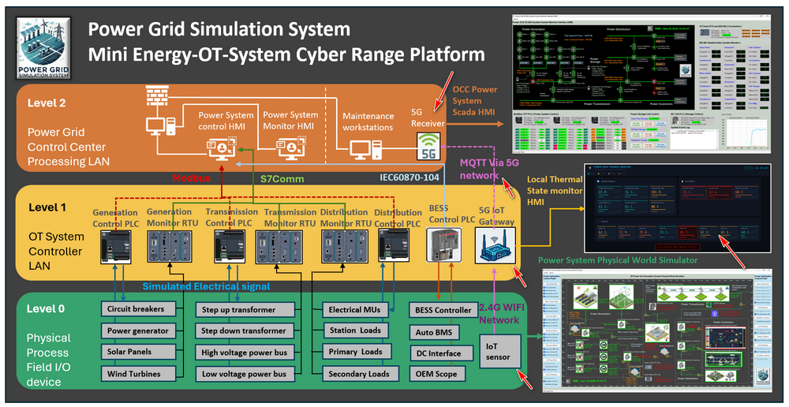
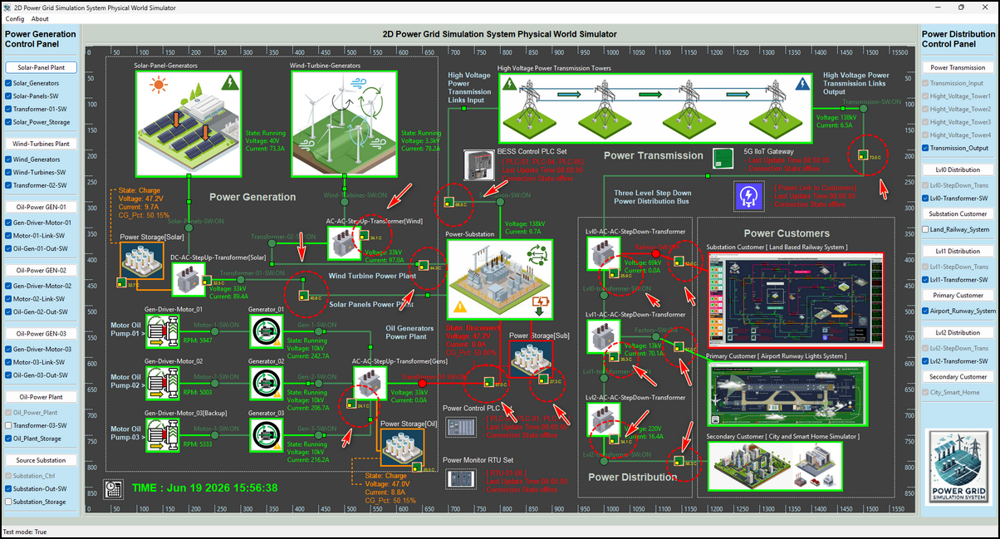
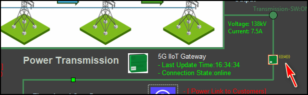
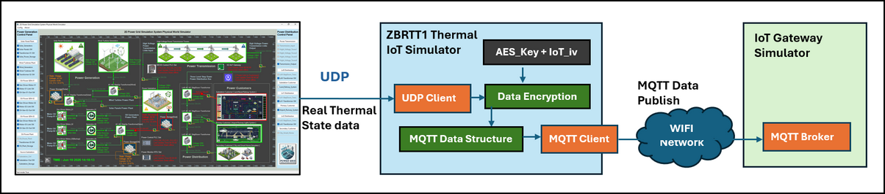
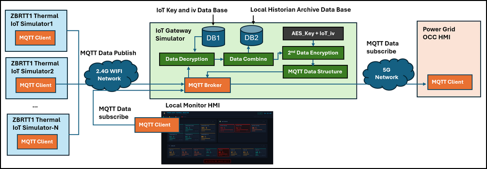
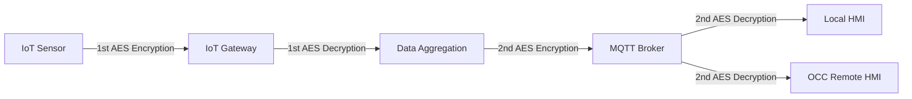
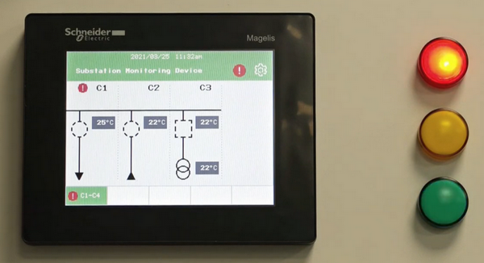
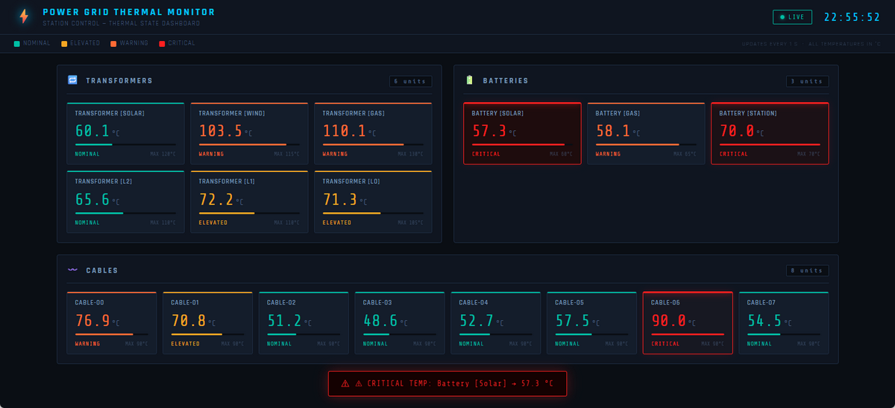
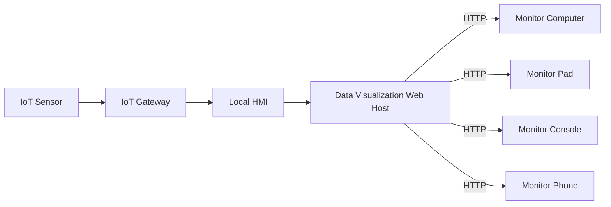

# Design of a Simulated 5G & Wi-Fi IIoT Thermal State Monitoring System (TSMS) for a Power Grid Cyber Twin

**Project Design Purpose** : This article introduces the design and implementation of a simulated Industrial Internet of Things (IIoT)-based thermal state monitoring system developed as part of the OT Power Grid Cyber Twin environment. The project recreates the core operational concepts of a wireless temperature monitoring solution, including Wi-Fi-IoT temperature sensors, a 5G IoT gateway, and a monitoring and control Human-Machine Interface (HMI).

The system is inspired by the functionality of the [Schneider Electric ZBRTT1 2.4KHz Wireless Temperature IoT Sensor](https://www.se.com/sg/en/product/ZBRTT1/wireless-transmitter-harmony-xb5r-transmitter-components-for-wireless-temperature-sensors-green-2400mhz/) solution and demonstrates how thermal condition monitoring can support power grid operations, equipment health assessment, abnormal condition detection, and fire risk alarm generation in modern electrical infrastructure. The project is organized into five major functional components:

- Real-Time Power Grid Thermal State Generation and Simulation
- Wi-Fi IIoT Power Grid Components Temperature Sensor 
- 5G Power Grid  Thermal IIoT Sensors Gateway Simulation
- System Components Communication and Data Transmission Security Function
- Thermal State Data Visualization and Abnormal Condition Detection

> **Important** : The simulated thermal state monitoring system in cyber twin will distill (**NOT** 1:1 emulate) a few OT processes from the real world and use digital constructs to represent them for the cyber exercise and education usage. The real world power grid's thermal monitor and control system will be much more complex than what I introduced in the article. 

```python
# Author:      Yuancheng Liu
# Created:     2026/06/18
# Version:     v_0.0.1
# Copyright:   Copyright (c) 2026 Liu Yuancheng
# License:     GNU General Public License V3
```

**Table of Contents**

[TOC]

------

### 1. Introduction

The **Thermal State Monitoring System (TSMS)** is a critical component of modern power grid infrastructure. It provides continuous, real-time monitoring of the thermal conditions of electrical assets such as power transformers, high-voltage transmission cables, switchgear, cable joints, connectors, and Battery Energy Storage Systems (BESS). By tracking temperature variations and identifying abnormal heat patterns, a TSMS helps utility operators prevent equipment failures, reduce fire risks, improve operational safety, and optimize power delivery efficiency.

To achieve these objectives, modern TSMS solutions typically integrate multiple sensing and monitoring technologies, including:

- **Fiber Optic Distributed Temperature Sensing (DTS):** Uses optical fibers deployed alongside power cables to provide continuous temperature measurements over long distances.
- **Infrared Thermography:** Employs thermal imaging cameras in substations and power facilities to detect abnormal heat signatures from transformers, switchgear, and other critical equipment.
- **IoT and Wireless Temperature Sensors:** Utilizes compact wireless sensors installed directly on high-voltage assets, cable joints, busbars, and electrical connectors to continuously measure and transmit temperature data.

The idea for the simulated **Wi-Fi and 5G IIoT-based Power Grid Thermal State Monitoring System** presented in this article was inspired by the Schneider Electric's IOT thermal sensor's product video published 5 years ago : https://youtu.be/LKCDbCJlYPo?si=8S81zykMe3NsBzSZ. Rather than replicating the commercial product in a one-to-one manner, this project extracts and simulates the key operational concepts within an OT Power Grid Cyber Twin environment to support cybersecurity training, research, education, and industrial control system (ICS) experimentation.

#### 1.1 Project Overview

The project overview diagram is shown below:


**1.1.1 Monitored Power Grid OT Components** 

There will be 4 type of components' thermal state will be monitored: 

- Power Grid Transformers
- Cable Connectors and Joints
- High-Voltage Power Transmission Cables
- Battery Energy Storage System (BESS) Components

**1.1.2 Local/Short Range Power Grid OT Environment** 

Each monitored asset is associated with a simulated IoT Thermal Sensor that periodically measures equipment temperature and transmits the collected data through a 2.4 GHz Wi-Fi network. The sensor data can be viewed locally through a Local Monitoring HMI or forwarded to a simulated 5G IoT Gateway.

**1.1.3 Long Range Power Grid OT Environment** 

The 5G gateway aggregates temperature measurements from multiple sensors and transmits the information through a simulated 5G communication network to the Power Grid Control Center, where an Operator Control Center (OCC) monitoring HMI performs centralized visualization, historical trend analysis, abnormal condition detection, and alarm management.


------

### 2. Cyber Twin ISA-95 Architecture 

To implement the Thermal State Monitoring System (TSMS) in the power grid cyber twin, several different component and modules are developed and deploy in different OT layers of the cyber twin under the ISA-95 standard as shown below: 



#### 2.1 System Components and Function

The project is organized into five major functional components:

**Real-Time Power Grid Thermal State Simulation**

- Generates simulated temperature data for critical power grid assets, including transformers, high-voltage switchgear, power transmission cables, electrical connectors, and Battery Energy Storage System (BESS) components. These thermal profiles represent the physical processes within the power grid cyber twin and serve as the primary data source for the monitoring system.

**Wi-Fi IoT Temperature Sensor Simulator**

- Simulates the core functions of a wireless IoT temperature sensor based on the operational principles of the Schneider ZBRTT1 device. The simulator periodically measures the thermal state of power system components and transmits temperature readings through a wireless network.

**5G IoT Gateway Simulator**

- Simulates a 5G-enabled industrial IoT gateway deployed near field devices, such as within substations or power distribution facilities. The gateway collects temperature measurements from multiple Wi-Fi-connected sensors and forwards the aggregated data to the power grid control center through a long-range 5G communication network.

**IoT Communication and Data Security**

- Simulates the data exchange process between IIoT devices using the Message Queuing Telemetry Transport (MQTT) protocol. The module also demonstrates message encryption and decryption mechanisms inspired by industrial wireless monitoring systems, providing a simplified representation of data confidentiality and communication security.

**Data Visualization and Abnormal Condition Detection**

- Simulates both local and centralized thermal monitoring HMIs for real-time data visualization, trend analysis, alarm management, and abnormal condition detection. The system can identify temperature anomalies, overheating events, and potential fire hazards based on predefined operational thresholds.


------

### 3. Design of Power Grid Thermal State Simulation

To provide realistic temperature measurements for the thermal monitoring system, the thermal state data of power grid assets is generated by the Physical World Simulator within the Power Grid Cyber Twin environment. The simulator continuously models the operating conditions of various electrical components and produces real-time temperature values that emulate the behavior of field-deployed thermal sensors.

Total of 17 simulated thermal sensors are distributed across different power grid assets. The monitored components are highlighted in the simulator interface using the ZBRTT1 thermal sensor icon as shown below in the power grid physical world simulation module:



Each simulated sensor generates temperature readings every second. The generated value is calculated using a baseline temperature combined with a small random fluctuation to emulate the gradual thermal variations typically observed in real-world electrical equipment.

#### 3.1 Simulated Thermal Data Generation

The temperature generation logic follows the operational state of the monitored component:

**3.1.1 Components Idle State**

When a power grid component is not actively carrying load (for example, when no current is flowing through a transmission cable), the sensor reports a temperature value close to the ambient environment temperature. A small random offset is added to simulate natural environmental fluctuations.

```
Component Temperature = Ambient Temperature + Random Value (0°C ~ 1°C)
```

**3.1.2 Components Operational State**

When the component is energized and carrying electrical load, the generated temperature is influenced by its operating condition. As the load increases, additional heat is produced due to electrical losses, resulting in higher measured temperatures.

The examples include:

- Higher transmission cable current resulting in increased cable temperature.
- Increased transformer loading causing higher winding and enclosure temperatures.
- Increased charge/discharge current in the Battery Energy Storage System (BESS) producing additional battery heat.
- Higher current flowing through cable connectors generating localized heating effects.

#### 3.2 Simulated Thermal Data Range

The simulator uses realistic operational temperature ranges derived from commonly observed values in power system equipment. These ranges provide the baseline for normal operation, warning conditions, and overheating scenarios.

**3.2.1 Transformer Operational Temp Range**

| Ambient Temperature              | Internal Winding Temperature | Max "Hot Spot" Temp |
| -------------------------------- | ---------------------------- | ------------------- |
| Current Temp to +40°C (Avg 30°C) | 55°C to 65°C above ambient   | Max 105°C - 120°C   |

The transformer winding temperature is typically significantly higher than the surrounding ambient temperature due to internal copper and core losses. The hot-spot temperature is one of the most important indicators used to assess transformer health and insulation aging.

**3.2.2 Power Transmission Cable Temp Range**

| Normal continuous operating range | Emergency overloads  range | short-circuit limits range |
| --------------------------------- | -------------------------- | -------------------------- |
| 70°C to 90°C                      | 105°C–130°C                | 160°C to 250°C             |

Cable temperatures increase as load current rises. Extended operation beyond the normal temperature range may accelerate insulation degradation and reduce cable service life.

**3.2.3 Battery Energy Storage System (BESS) Temp Range** 

| Optimal Operational Range | Extreme Weather Range | Over heat range |
| ------------------------- | --------------------- | --------------- |
| 15°C to 35°C (avg 25 °C)  | 35°C to 50/55°C       | Above 60 °C     |

Battery temperature is a critical safety parameter. Excessive temperatures can reduce battery performance, shorten service life, and potentially increase the risk of thermal runaway events.

#### 3.3 Data Interaction and Connection

The Physical World Simulator transmits the generated thermal data to the corresponding IoT thermal sensor simulators once every second using UDP. Each temperature value is associated with a unique sensor ID representing a specific monitored component. An example of the generated thermal data is shown below:

```
Data from RW : {'TF_SO': 32.1, 'TF_WI': 23.7, 'TF_GA': 39.4, 'TF_L0': 20.6, 'TF_L1': 20.1, 'TF_L2': 29.1, 'BT_SO': 29.4, 'BT_GA': 16.0, 'BT_ST': 33.8, 'CB_00': 74.1, 'CB_01': 50.2, 'CB_02': 51.1, 'CB_03': 59.8, 'CB_04': 67.1, 'CB_05': 69.1, 'CB_06': 59.7, 'CB_07': 70.8}
```

Upon successfully receiving updated thermal measurements, the corresponding IoT thermal sensor simulator updates its internal state and displays a **yellow communication indicator** within the cyber twin environment, indicating that live sensor data is being received from the Physical World Simulator as shown below:




------

### 4. Design of ZBRTT1 Thermal IoT Simulator 

To emulate a distributed wireless thermal monitoring deployment, the cyber range contains **17 ZBRTT1 Thermal IoT Simulators**, with each simulator representing an individual wireless temperature sensor installed on a specific power grid asset. 

#### 4.1 Simulator Architecture

The workflow of the ZBRTT1 Thermal IoT Simulator is shown below : 



The simulator consists of four major functional modules:

- UDP Client Module : Real time thermal state data fetching. 
- Data Encryption Module : IoT Data Protection. 
- MQTT Data Structure Module : Data processing and timestamp combination. 
- MQTT Client Module : Data publish to upper layer OT device. 

#### 4.2 Data Exchange Interfaces

Each IoT simulator is deployed as an independent virtual machine (VM) within the Physical World Subnet with 2 network interface linked both the green team network and blue team network. Each IoT simulator maintains two logical communication interfaces that connect the Physical World Simulator and the IoT communication infrastructure.

- **Physical World Data Interface** : The first interface connects the IoT simulator to the Physical World Simulator through the Green Team network. The simulator receives real-time thermal state data from the corresponding power grid asset using the User Datagram Protocol (UDP).
- **Wireless IoT Communication Interface** : The second interface consists of an MQTT Client connected to the simulated 2.4 GHz Wi-Fi network. This interface is responsible for publishing thermal sensor data to the IoT Gateway Simulator.

#### 4.3 Thermal Data Processing Workflow

When a new temperature value is received from the Physical World Simulator, the IoT simulator performs the following sequence of operations:

- **Step 1 – Receive Thermal Data** : The UDP Client receives the latest thermal measurement from the Physical World Simulator then add the current timestamp to the thermal data `temperature value; timestamp` . 
- **Step 2 – Encrypt Sensor Data** : the received thermal data is encrypted using the AES-128 encryption algorithm with a pre-configured AES secret key (`AES_Key`) and a pre-configured initialization vector (`IoT_IV`)
- **Step 3 – Construct MQTT Payload** : ciphertext is stored within the simulator's MQTT data structure and associated with the corresponding MQTT topic `powergrid/thermal/<sensor_id>`. 
- **Step 4 – Publish Data to the IoT Gateway** : MQTT Client publishes the encrypted payload through the simulated Wi-Fi network to the IoT Gateway Simulator.


------

### 5. Design of 5G IoT Gateway Simulator

To simulate the communication architecture of a modern power grid thermal monitoring system, the 17 ZBRTT1 Thermal IoT Simulators are divided into multiple deployment groups representing sensors installed across different substations, transformer stations, and power distribution facilities. Each group of IoT sensors communicates with a designated 5G IoT Gateway Simulator.

The System workflow diagram is shown below: 



#### 5.1 Gateway Deployment Architecture

Each 5G IoT Gateway Simulator is deployed as an independent virtual machine within the cyber range environment. The gateway contains two network interfaces to simulate its role as a bridge between field devices and higher-level monitoring systems.

**5.1.1 Level 2 OT Network Interface (2.4 GHz Wi-Fi)**

The first network interface is connected to the simulated **Level 2 OT Blue Team Network**, representing a local 2.4 GHz Wi-Fi network used by the thermal IoT sensors. The interface will be responsible for:

- Receiving MQTT publications from multiple ZBRTT1 Thermal IoT Simulators.
- Providing MQTT subscription services to local monitoring HMIs.

**5.1.2 Level 3 OT Network Interface (5G Network)**

The second network interface is connected to the simulated **Level 3 OT Blue Team Network**, representing a private industrial 5G communication network. This interface allows:

- Remote monitoring systems to subscribe to thermal monitoring data.
- Data transmission between substations and the Power Grid Control Center.

#### 5.2 MQTT Communication Services

Each gateway hosts an MQTT Broker that serves as the communication hub for all connected devices and monitoring applications. The broker supports three primary communication flows:

- MQTT Publish Requests from IoT Sensors via Wi-Fi network.
- MQTT Subscribe Requests from Local Monitoring HMI through the simulated 2.4 GHz Wi-Fi network.
- MQTT Subscribe Requests from OCC Monitoring HMI subscribes through the simulated 5G network.

#### 5.3 Gateway Database Design

To support data processing and security operations, each gateway maintains two dedicated databases.

**5.3.1 IoT Security Database (DB1)** 

The first database stores the cryptographic information associated with each connected IoT sensor, including:

- Sensor Identifier (Sensor ID)
- AES-128 Encryption Key
- Initialization Vector (IV) / Nonce

**5.3.2 Local Historian Database (DB2)**

The second database functions as a local historian system that archives thermal measurements received from the connected IoT sensors. The historian database stores:

- Sensor temperature readings
- Gateway aggregation records
- Event timestamps
- Communication status information

#### 5.4 Thermal Data Aggregation Workflow

When a thermal IoT sensor publishes a new encrypted temperature measurement, the gateway performs the following processing sequence.

- **Step 1 – Receive MQTT Message** : The MQTT Broker receives the encrypted payload published by a thermal IoT sensor.
- **Step 2 – Decrypt Sensor Data** : The gateway identifies the originating sensor and retrieves the corresponding AES encryption key and initialization vector from the IoT Security Database. The received payload is then decrypted to recover the original temperature measurement.
- **Step 3 – Aggregate Sensor Measurements **: The gateway continuously maintains the latest thermal reading from every connected sensor. After processing incoming updates, the gateway combines the most recent measurements into a consolidated data structure. Example: 

```python
{
    'Gateway_ID': '0001001',
    'Sensors':{'TF_SO': 32.1, 'TF_WI': 23.7, 'TF_GA', 'BT_SO': 29.4, 'BT_GA': 16.0, 'BT_ST':BT_ST},
    'timestamp': ...
}
```

- **Step 4 – Archive Gateway Data** : The aggregated thermal data structure is stored in the Local Historian Database for future analysis. 
- **Step 5 – Gateway-Level Encryption** :  After aggregation, the gateway performs a second AES-128 encryption process using its own gateway-specific encryption key and initialization vector.
- **Step 6 – Publish Gateway Data** : The encrypted gateway payload is stored within the MQTT data structure and made available for subscription by authorized monitoring systems.


------

### 6. Design of IoT Communication and Data Security

The simulated thermal monitoring system relies on Industrial Internet of Things (IIoT) communication technologies to exchange thermal state data between field sensors, IoT gateways, and monitoring HMIs. To emulate a realistic industrial deployment, the cyber twin incorporates both MQTT-based communication and multiple layers of data protection mechanisms.

#### 6.1 IoT Data Communication

he thermal monitoring system uses the **Message Queuing Telemetry Transport (MQTT)** protocol as the primary communication mechanism between the thermal IoT sensors, IoT gateways, and monitoring HMIs.

For detailed information regarding the MQTT communication framework, protocol implementation, and data exchange mechanisms used in this project, please refer to the MQTT Communication Module documentation:

Python Virtual RTU/IIoT Simulator – IEC 20922 MQTT Protocol Communication Module : https://www.linkedin.com/pulse/python-virtual-rtuiiot-simulator-iec-20922-mqtt-protocol-liu-gbqnc

#### 6.2 Data Exchange Security

To simulate the security architecture commonly deployed in industrial IoT environments, the system implements two layers of communication protection:

- **Transport-Level Security** : At the MQTT communication layer, the system supports ****Secure Sockets Layer (SSL) and Transport Layer Security (TLS) technologies to establish encrypted communication channels between MQTT clients and MQTT brokers.
- **Application-Level Data Encryption** : In addition to SSL/TLS transport security, the thermal monitoring system applies AES-128 encryption directly to the sensor payload before transmission

After decrypting and aggregating the thermal measurements from multiple sensors, the IoT Gateway performs a second encryption operation before making the data available to monitoring clients.

- Each ZBRTT1 Thermal IoT Simulator is assigned an `AES-128 encryption key (AES_Key)` and `Initialization Vector (IV).` 
- Each gateway maintains its own Gateway and `AES-128 Encryption Key` and `Gateway Initialization Vector (IV)`. 

The Gateway-to-HMI Data Protection flow is shown below:



All the data remains protected throughout its entire lifecycle, from generation at the simulated field sensor to visualization at the monitoring console.


------

### 7. Data Visualization and Abnormal Condition Detection

#### 7.1 Local Thermal State HMI

In the power station, power plant, there will be several state monitoring HMI for the staff to check the system operation state as shown below : 



In the cyber twin thermal state management system, we also developed a flask web based local HMI program which can host in different computer, pad and terminals to monitor the system operational data in real time. The UI is shown below: 



Each thermal IoT will be categorized in related group,  data and related operation range will shown in the item's tab. And the alert will be shown at the bottom.

Before use, there will be a fast configuration step, each local HMI need to peering with the IoT gateway in the same WiFi network or local ethernet: 

- IoT gateway IP address and MQTT port. 
- Install the IoT gateway AES128 key and iv in the local HMI. 
- Added the display parameter's list in the HMI configuration file and set the alarm trigger data range. 

Each Local HMI can only linked to one of the 3 IoT gateway. 

As the HMI provide web service, so one HMI can provide data visualization for multiple device (computer, pad, terminal, or phone) in the network with the username and password access authorization.  The data flow is shown below:



#### 7.2 OCC Remote Thermal State HMI 

For the OCC remote Thermal State Visualization HMI, as its geo-location is far away from the power plant/station in the grid, it will use 5G network to connect to all the 3 IoT gateway to fetch the data. 

 For the data visulization.


------


https://youtu.be/LKCDbCJlYPo?si=8S81zykMe3NsBzSZ

https://www.se.com/au/en/download/document/GDE58746/

