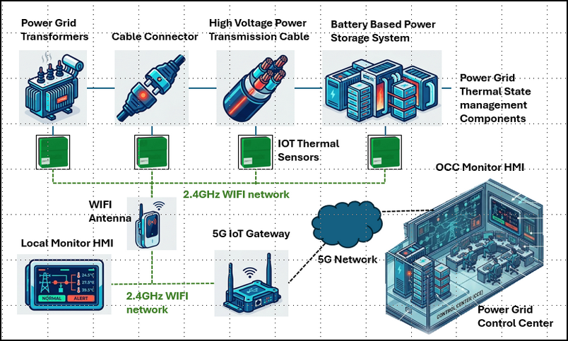

# Design of a Simulated 5G & Wi-Fi IIoT Thermal State Monitoring System (TSMS) for a Power Grid Cyber Twin

**Project Design Purpose** : This article introduces the design and implementation of a simulated Industrial Internet of Things (IIoT)-based thermal state monitoring system developed as part of the OT Power Grid Cyber Twin environment. The project recreates the core operational concepts of a wireless temperature monitoring solution, including Wi-Fi-IoT temperature sensors, a 5G IoT gateway, and a monitoring and control Human-Machine Interface (HMI).

The system is inspired by the functionality of the [Schneider Electric ZBRTT1 2.4KHz Wireless Temperature IoT Sensor](https://www.se.com/sg/en/product/ZBRTT1/wireless-transmitter-harmony-xb5r-transmitter-components-for-wireless-temperature-sensors-green-2400mhz/) solution and demonstrates how thermal condition monitoring can support power grid operations, equipment health assessment, abnormal condition detection, and fire risk alarm generation in modern electrical infrastructure. The project is organized into five major functional components:

- Real-Time Power Grid Thermal State Generation and Simulation
- Wi-Fi IIoT Power Grid Components Temperature Sensor 
- 5G Power Grid  Thermal IIoT Sensors Gateway Simulation
- System Components Communication and Data Transmission Security Function
- Thermal State Data Visualization and Abnormal Condition Detection

> **Important** : The simulated thermal state monitoring system in cyber twin will distill (**NOT** 1:1 emulate) a few OT processes from the real world and use digital constructs to represent them for the cyber exercise and education usage. The real world power grid's thermal monitor and control system will be much more complex than what I introduced in the article. 

```python
# Author:      Yuancheng Liu
# Created:     2026/06/18
# Version:     v_0.0.1
# Copyright:   Copyright (c) 2026 Liu Yuancheng
# License:     GNU General Public License V3
```

**Table of Contents**

[TOC]

------

### 1. Introduction

The **Thermal State Monitoring System (TSMS)** is a critical component of modern power grid infrastructure. It provides continuous, real-time monitoring of the thermal conditions of electrical assets such as power transformers, high-voltage transmission cables, switchgear, cable joints, connectors, and Battery Energy Storage Systems (BESS). By tracking temperature variations and identifying abnormal heat patterns, a TSMS helps utility operators prevent equipment failures, reduce fire risks, improve operational safety, and optimize power delivery efficiency.

To achieve these objectives, modern TSMS solutions typically integrate multiple sensing and monitoring technologies, including:

- **Fiber Optic Distributed Temperature Sensing (DTS):** Uses optical fibers deployed alongside power cables to provide continuous temperature measurements over long distances.
- **Infrared Thermography:** Employs thermal imaging cameras in substations and power facilities to detect abnormal heat signatures from transformers, switchgear, and other critical equipment.
- **IoT and Wireless Temperature Sensors:** Utilizes compact wireless sensors installed directly on high-voltage assets, cable joints, busbars, and electrical connectors to continuously measure and transmit temperature data.

The idea for the simulated **Wi-Fi and 5G IIoT-based Power Grid Thermal State Monitoring System** presented in this article was inspired by the Schneider Electric's IOT thermal sensor's product video published 5 years ago : https://youtu.be/LKCDbCJlYPo?si=8S81zykMe3NsBzSZ. Rather than replicating the commercial product in a one-to-one manner, this project extracts and simulates the key operational concepts within an OT Power Grid Cyber Twin environment to support cybersecurity training, research, education, and industrial control system (ICS) experimentation.

#### 1.1 Project Overview

The project overview diagram is shown below:



**1.1.1 Monitored Power Grid OT Components** 

There will be 4 type of components' thermal state will be monitored: 

- Power Grid Transformers
- Cable Connectors and Joints
- High-Voltage Power Transmission Cables
- Battery Energy Storage System (BESS) Components

**1.1.2 Local/Short Range Power Grid OT Environment** 

Each monitored asset is associated with a simulated IoT Thermal Sensor that periodically measures equipment temperature and transmits the collected data through a 2.4 GHz Wi-Fi network. The sensor data can be viewed locally through a Local Monitoring HMI or forwarded to a simulated 5G IoT Gateway.

**1.1.3 Long Range Power Grid OT Environment** 

The 5G gateway aggregates temperature measurements from multiple sensors and transmits the information through a simulated 5G communication network to the Power Grid Control Center, where an Operator Control Center (OCC) monitoring HMI performs centralized visualization, historical trend analysis, abnormal condition detection, and alarm management.


------

### 2. Cyber Twin ISA-95 Architecture 

To implement the Thermal State Monitoring System (TSMS) in the power grid cyber twin, several different component and modules are developed and deploy in different OT layers of the cyber twin under the  ISA-95 standard as shown below: 


The **Thermal State Monitoring System (TSMS)** in a power grid is a continuous, real-time diagnostic framework designed to track, analyze, and manage the temperature profiles of critical electrical infrastructure (cables, transformers, switchgear, and overhead lines) to prevent equipment failure, reduce fire risks, and optimize power delivery. 

A TSMS relies on a network of specialized sensors and advanced data processing to map the grid's thermal landscape:

- **Fiber Optic Sensing (DTS):** Uses optical cables running alongside power lines to provide real-time temperature profiles over long distances.
- **Infrared Thermography:** Non-contact thermal cameras placed in substations to monitor transformers and switchgear for abnormal heat signatures. 
- **IoT & Wireless Sensors:** Self-powered sensors placed directly on high-voltage components (like joints and busbars) to transmit continuous temperature readings

The idea of this simulated WIFI and 5G IoT based Power Grid Thermal State Monitoring System comes from the Schneider Electric's IOT thermal sensor's product video published 5 years ago : https://youtu.be/LKCDbCJlYPo?si=8S81zykMe3NsBzSZ, so I want also follow the idea to simulate the similar function in the cyber twin system I developed. 

#### 1.1 Project Overview

The project overview diagram is shown below: 


1.2 Sysetm 


This article introduces the design of a simulated Industry IoT based thermal state monitoring system in the OT Power Grid Cyber Twin I developed. The goal is to use the software simulated the basic function of a Schneider ZBRTT1 wireless(wifi) temperature system, IoT gateway(5G) and the related monitor and control HMI to demonstrate how the thermal state monitoring system supports the operation, abnormal scenario detection and fire alarm raising of a modern power grids. 

The project is structured into four main sections :

- **Real Time Power Grid Thermal State simulation** : Generate different simulated operational temperature data of the component (transformer, high voltage, power transmission cable, connector and battery in BESS) for the physical world simulator of the power grid cyber twin. 
- **WIFI IoT Temperature Sensor Simulator** : Simulate the basic function and component temperature measurement progress of the Schneider ZBRTT1 wireless(wifi) IOT temperature sensor. 
- **5G IoT Gateway Simulator** : simulate the 5G IIoT gateway components which allocated near the IoT sensors (such as in one power station) to collect the data from IOT sensors via WIFI network then transfer the data to the power grid control center via 5G network (long range) 
- **IoT Communication and Data Encryption** : Simulate the IoT data publish and subscribe progress between each component via  Message Queuing Telemetry Transport protocol and the message encryption/decryption (used by ZBRTT1 ) for information security protection. 
- **Data Visualization and  Abnormal Detection**: Simulate the thermal state monitoring HMI (Local or Control Center) for data visualization and the data analysis with the abnormal or alarm detection logic.  


https://youtu.be/LKCDbCJlYPo?si=8S81zykMe3NsBzSZ

https://www.se.com/au/en/download/document/GDE58746/

