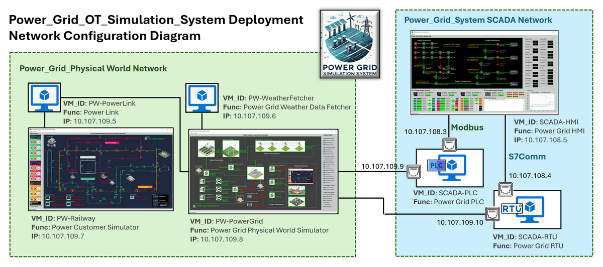
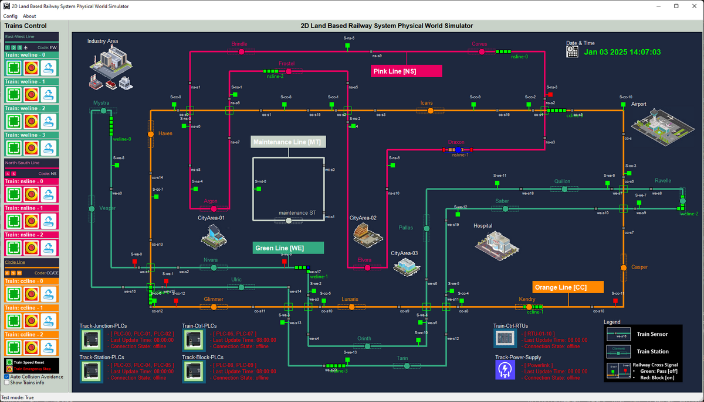
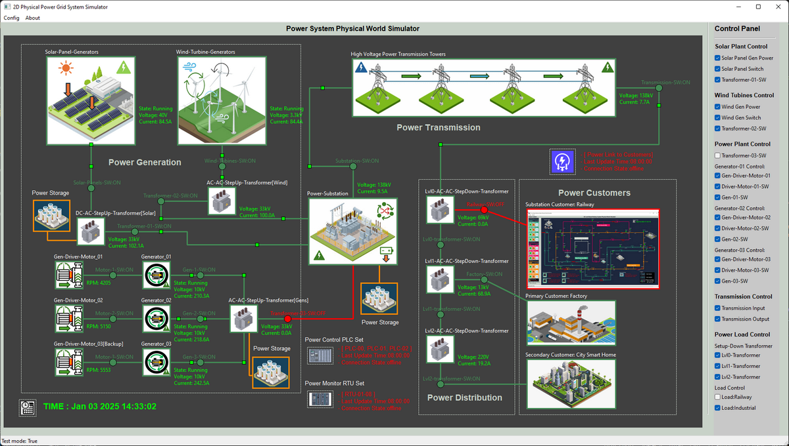
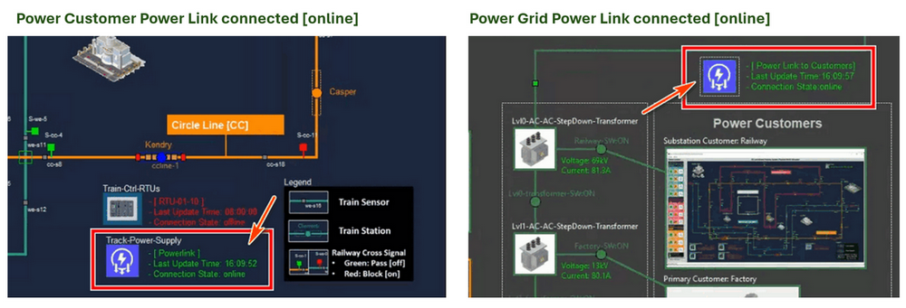
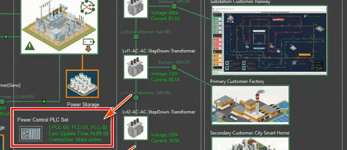
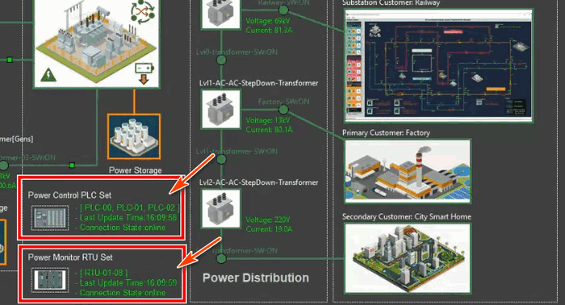
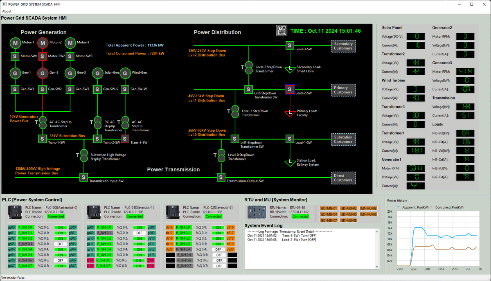
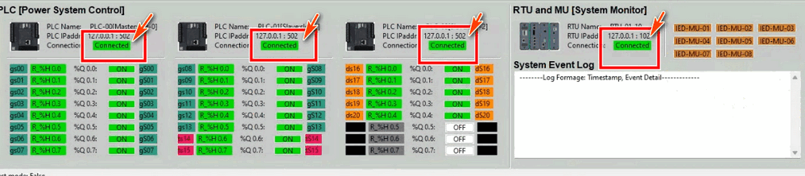

# Power_Grid_Simulation_System [ System Deployment ]

This document guides green team engineers through deploying the simulation system's modules across various virtual machines (VMs) or physical devices. It also includes an example of integrating the power grid simulation with a power customer system, such as a land-based railway system. This document include two main sections : 

- **Network Environment Introduction** :  A short introduction about the network topology and the vm information (such as OS type, ip address configuration)
- **System Deployment Steps** : Detailed steps to configure the network routing rule and deploy the program on each VMs.


```python
# Author:      Yuancheng Liu
# Created:     2025/04/14
# Version:     v_0.2.0
# DocNum:      Wiki_3_2
```

**Table of Contents**

[TOC]

------

### Network Environment Introduction

To deploy the Power_Grid_OT_Simulation_System system with one power customer, a minimum of seven virtual machines (VMs) or physical machine are required, along with two isolated networks connected through one network switches. 

- The **Power_Grid_Physical World Network** hosts all physical-world simulation programs, including the power grid physical world simulator, weather data fetcher, power link connector, and power customer modules. This network is exclusively accessible to the green and blue teams.
- The **Power_Grid_System SCADA Network** contains OT supervisory control and data acquisition components, such as one or multiple PLC simulators,  one or multiple RTU simulators, and a human-machine interface (HMI) program. This network can be accessed by the green, blue, and red teams.

The network configuration diagram is shown below:



Each PLC and RTU VM is configured with dual network interfaces to enable communication across both networks.

The recommended operating system for the Power Customer VM, Power Grid VM, and SCADA-HMI VMs is **Windows 11**, while **Ubuntu 22.04** is recommended for all other VMs to ensure compatibility with the required modules and libraries.

Deployment should follow the sequence outlined in the table below:

| VM Name          | Deploy Seq | OS Type | Physical World IP | SCADA IP     | Program/Module Needed                |
| ---------------- | ---------- | ------- | ----------------- | ------------ | ------------------------------------ |
| **PW-Railway**   | 1          | Win11   | 10.107.109.7      | N.A          | `lib` , `<Railway>PhysicalWorldSimu` |
| **PW-PowerGrid** | 2          | Win11   | 10.107.109.8      | N.A          | `lib`, `<Powergrid>PhysicalWorldEmu` |
| **PW-PowerLink** | 3          | Ubuntu  | 10.107.109.5      | N.A          | `powerlink`                          |
| **PW-Weather**   | 4          | Ubuntu  | 10.107.109.6      | N.A          | `weatherFetcher`                     |
| **SCADA-PLC**    | 5          | Ubuntu  | 10.107.109.9      | 10.107.108.3 | `lib`, `plcCtrl`                     |
| **SCADA-RTU**    | 6          | Ubuntu  | 10.107.109.10     | 10.107.108.4 | `lib`, `rtuCtrl`                     |
| **SCADA-HMI**    | 7          | Win11   | N.A               | 10.107.108.5 | `lib`, `ScadaHMI`                    |

For details on the required modules, refer to the **Program File List** section in the system setup portion of the **README** file. Each VM must also have the necessary libraries installed according to the setup instructions provided.


------

### System Deployment Steps

This section will use the previous section as an example to deploy the program on each VM in the system.


#### Deploy Power Customer Railway System VM

**Step 1: Set Up the Power Customer Railway System Program Files**

- Follow the program setup instructions in railway system readme file https://github.com/LiuYuancheng/Railway_IT_OT_System_Cyber_Security_Platform/blob/main/README.md to install the required libraries.
- Create a program directory structure: `railway/src` in the machine or VM.
- Copy the `lib` and `RailwayPhysicalWorldSimu` modules into the `src` folder.

**Step 2: Update the Application Configuration File**

- Rename the `src/RailwayPhysicalWorldSimu/configFiles/metroConfig_template.txt` to `src/RailwayPhysicalWorldSimu/configFiles/metroConfig.txt` . 
- Since the railway system acts as the power customer in this deployment, update the configuration file to enable test mode by setting the flag to `True` (line 9). The modified section should look like this:

```
# This is the config file template for the railway system module <RailwayPWSimuRun.py>
# Setup the parameters with below format (every line follow <key>:<value> format, the
# key can not be changed):
#-----------------------------------------------------------------------------
# Config section 0: Basic general parameter config.
# Test mode flag:
# - True: use the physical word internal code to simulate the control logic. 
# - False: connect to PLC and let PLC(s) control all the signals and trains.
TEST_MD:True
...
```

**Step3: Run the power customer railway system program**

- Navigate(cd) to the `physicalWorldSimu` folder and run the railway physical world simulator program with command  `python3 RailwayPWSimuRun.py`.
- Once executed, the railway system UI will appear, as shown below:




#### Deploy Power Grid Physical World Simulator VM

**Step1: Setup program files** 

- Follow the program setup instructions in readme file to install the required libraries.
- Create a program directory structure: `power/src` in the machine or VM.
- Copy the `lib` and `PhysicalWorldEmu` modules into the `src` folder.

**Step 2: Update the Application Configuration File**

- Rename the `src/PhysicalWorldEmu/powerGridPWConfig_template.txt` to `src/PhysicalWorldEmu/powerGridPWConfig.txt` 
- Open the configuration file and update it as shown below. Ensure the test mode flag (`TEST_MD`) is set to `False` to enable PLC-controlled signals.

```python
# This is the config file template for the module <PowerGridPWRun.py>
# Setup the parameters with below format (every line follow <key>:<val> format, the
# key can not be changed):
#-----------------------------------------------------------------------------
# Test mode:
# True: use the real word internal logic to simulator the control logic. 
# False: connect to PLC let plc control the signals 
TEST_MD:True
#-----------------------------------------------------------------------------
# Init the dataManager port for PLC to fetch and set data. 
UDP_PORT:3001
# Init Plc connection time out, if plc is not connect in num of seconds, the 
# system will treat it as offline
PLC_TIMEOUT:3
#-----------------------------------------------------------------------------
# define UI title name 
UI_TITLE:2D Power Grid Simulation System Physical World Simulator
# Init the UI update interval:
UI_INTERVAL:0.8
#-----------------------------------------------------------------------------
# Power grid item state config file name for the simulator
STATE_FILE:itemStateCfg.json
# flag to identify if the solar power will generate based on time
SOLAR_TIME_FLG:True
```

**Step3: Run the Power Grid Physical World Simulator**

- Navigate(cd) to the `physicalWorldSimu` folder and run the railway physical world simulator program with command  `python3 PowerGridPWRun.py`, 
- After running the program, the Power Grid system UI will appear, as shown below:




------

#### Deploy Power Link Program VM

The power link VM is used for link the power grid physical world simulator with multiple power customers such as the railway system.

**Step1: Setup program files** 

- Follow the program setup instructions in readme file to install the required libraries.
- Create a program directory structure: `power/src` in the machine or VM.
- Copy the `powerlink` modules into the `src` folder.

**Step2: Change the application configuration file**

- Rename the `src/powerlink/powerLinkConfig_template.json` to `src/powerlink/powerLinkConfig.json` 
- Update the config file as shown below based on the IP address

```json
{
    "PowerGrid": {
        "ip": "10.107.109.8",
        "port": 3001
    },
    "Customer": [
        {
            "name": "railway",
            "ip": "10.107.109.7",
            "port": 3001
        }
    ]
}
```

**Step3: Run the power link program**

Navigate(cd) to the `powerlink` folder and run the power link program with command  `python3 PowerLinkRun.py`, then check whether the power link icon on the power grid  and power customer are changed to green color as shown below image:




------

#### Deploy Power Grid Weather Fetcher VM

The Weather Fetcher program provides real-time weather information for the configured location, enabling accurate simulation of the power grid system's solar panel and wind turbine operations.

**Step 1: Set Up Program Files**

- Follow the program setup instructions in readme file to install the required libraries.
- Create a program directory structure: `power/src` in the machine or VM.
- Copy the `weatherFetcher` modules into the `src` folder.

**Step 2: Update the Application Code**

The Weather Fetcher program does not use a configuration file. Instead, you need to manually modify lines 28–32 in the `weatherFetcher.py` file to specify the desired city and network parameters. Update the code as shown below:

```python
# Set the city string to your location.
CityStr = 'Singapore'
# Set the UDP port to the physical world simulation program.
PW_IP = '10.107.109.8'
PW_PORT = 3001
```

Replace `Singapore` with the name of your desired city and update the IP address (`PW_IP`) and port (`PW_PORT`) to match your system's configuration.

**Step 3: Run the Power Grid Weather Fetcher Program**

- Navigate(cd) to the `weatherFetcher` folder and run the weather information fetcher program with command  `python3 weatherFetcher.py`. 


------

#### Deploy SCADA-PLC Emulator VM

**Step 1: Setup the program**

- Follow the program setup instructions to install the required libraries.
- Create a program directory structure: `power/src` in the machine or VM.
- Copy the `lib` and `plcCtrl`modules into the `src` folder.

**Step 2: Update the Application Configuration File**

- Rename the `src/plcCtrl/plcConfig_template.txt` to `src/plcCtrl/plcConfig.txt` 
- Open the configuration file and update it as shown below.

```
# This is the config file template for the module <plcSimulatorPwr.py>
# Setup the parameter with below format (every line follow <key>:<val> format, the
# key can not be changed):
#-----------------------------------------------------------------------------
# Set the master PLC's name 
PLC_NAME:PLC-01-03
#-----------------------------------------------------------------------------
# Define the ip addresses allowed to read PLC state: 
# json list format: ["masterIP", "slave1IP", ...]
ALLOW_R_L:["10.107.108.5"]
# Define the ip addresses allowed to change PLC state: 
# json list format: ["masterIP", "slave1IP", ...]
ALLOW_W_L:["10.107.108.5"]
#-----------------------------------------------------------------------------
# Define Real-world emulator ip
RW_IP:10.107.109.8
# Define Real-world emulator connection port
RW_PORT:3001
# Define PLC clock interval
CLK_INT:0.9
#-----------------------------------------------------------------------------
# Define Modbus TCP host IP, use 0.0.0.0 or localhost
MD_BUS_IP:0.0.0.0
# Define Modbus TCP host Port, normally use 502
MD_BUS_PORT:502
```

**Step 3: Run the Power Grid SCADA-PLC Program**

- Navigate(cd) to the `plcCtrl` folder and run the power grid SCADA-PLC program with command  `sudo python3 plcSimulatorPwr.py` , for the PLC program we need the sudo permission for executing the program.
- When the PLC simulation program connected the the power grid physical world simulator, the PLC Icon and connection situation on power grid physical simulator user interface will be change to green color as shown below:




------


#### Deploy SCADA-RTU Emulator VM

**Step 1: Setup the program**

- Follow the program setup instructions to install the required libraries.
- Create a program directory structure: `power/src` in the machine or VM.
- Copy the `lib` and `rtuCtrl`modules into the `src` folder.

**Step 2: Update the Application Configuration File**

- Rename the `src/rtuCtrl/rtuConfig_template.txt` to `src/rtuCtrl/rtuConfig.txt` 
- Open the configuration file and update it as shown below.

```
# This is the config file template for the module <rtuSimulatorPower.py>
# Setup the parameter with below format (every line follow <key>:<val> format, the
# key can not be changed):
#-----------------------------------------------------------------------------
# Set the master RTU's name 
RTU_NAME:RTU-01-08
#-----------------------------------------------------------------------------
# Define Real-world emulator ip
RW_IP:10.107.109.8
# Define Real-world emulator connection port
RW_PORT:3001
# Define PLC clock interval
CLK_INT:2
#-----------------------------------------------------------------------------
# Define Modbus TCP host IP, use 0.0.0.0 or localhost
S7COMM_IP:0.0.0.0
# Define Modbus TCP host Port, normally use 502
S7COMM_PORT:102
```

**Step 3: Run the Power Grid SCADA-RTU Program**

- Navigate(cd) to the `rtuCtrl` folder and run the power grid SCADA-RTU program with command  `sudo python3 rtuSimulatorPower.py` , for the RTU program we need the sudo permission for executing the program.
- When the RTU simulation program connected the the power grid physical world simulator, the RTU Icon and connection situation on power grid physical simulator user interface will be change to green color as shown below:




------

#### Deploy SCADA-HMI Program VM

The human machine interface program is used to connect to the PLC&RTU to remote control the power grid system.

**Step 1: Setup the program**

- Follow the program setup instructions to install the required libraries.
- Create a program directory structure: `power/src` in the machine or VM.
- Copy the `lib` and `ScadaHMI`modules into the `src` folder.

**Step 2: Update the Application Configuration File**

- Rename the `src/ScadaHMI/scadaHMIConfig_template.txt` to `src/ScadaHMI/scadaHMIConfig.txt` 
- Open the configuration file and update it as shown below.

```
# This is the config file template for the module <ScadaHMIRun.py>
# Setup the parameter with below format (every line follows <key>:<val> format, the
# key can not be changed):
#-----------------------------------------------------------------------------
# Test mode:
# True: use the simulation data without connect to the PLC module.
# False: connect to PLC via Modbus TCP, fetch and set the PLC real state.
TEST_MD:False
#-----------------------------------------------------------------------------
# Init the sensor-signal PLC set information
PWR_PLC_ID:PLC-00
PWR_PLC_IP:10.107.108.3
PWR_PLC_PORT:502
#-----------------------------------------------------------------------------
# Init the RTU(need to connect) information 
RTU_ID:RTU-01-10
# Target RTU IP address 
RTU_IP:10.107.108.4
# Target RTU Port (default 102) 
RTU_PORT:102
#-----------------------------------------------------------------------------
# Define all the HMI UI config parameters
# define UI title name 
UI_TITLE:POWER_GRID_SYSTEM_SCADA_HMI
# Define update clock interval
CLK_INT:2
```

**Step 3: Run the Power Grid SCADA-HMI Program**

- Navigate(cd) to the `ScadaHMI` folder and run the power grid SCADA-HMI program with command  `python3 ScadaHMIRun.py` , after running the program, the Power Grid system UI will appear, as shown below:



- Verify that the RTU and PLC are connected properly to the HMI as shown below (Connection indicator shows connected and green color) :




------

> Last edit by LiuYuancheng(liu_yuan_cheng@hotmail.com) at 15/01/20245 if you have any problem, please send me a message.  