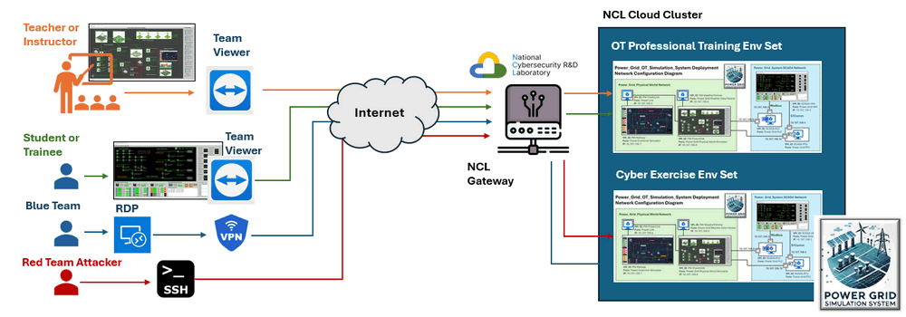

# Power Grid System Environment Access Manual

This document provides detailed instructions on remotely accessing various VMs in the Power Grid Simulation System environment hosted within the NUS-NCL cloud infrastructure.. 


```
# Author:      Yuancheng Liu
# Created:     2025/02/18
# Version:     v_0.0.2
# DocNum:      Wiki_4_3
```

[TOC]

------

### Introduction

The Power Grid Simulation System is hosted within the NUS-NCL cloud infrastructure, enabling users to access and interact with the system remotely. Multiple instances of the environment can be deployed based on user-specific needs, such as cybersecurity exercises or training sessions.

To ensure seamless remote access, we offer multiple connectivity options tailored to user preferences:

- **TeamViewer**: For accessing VMs with a graphical user interface (GUI).
- **VPN + RDP**: For GUI-based access to VMs.
- **SSH Connection**: For terminal-based access to standard VMs, ideal for lightweight operations.

The remote access architecture is illustrated below:



To access the VMs in the cluster, users are provided with **three types of credentials**:

**[1] TeamViewer Peer ID and Password** 

Each Windows-based VM is preconfigured with TeamViewer for GUI access. There are three unique Peer IDs (with the same password) assigned for the following VMs:

- Power Grid System physical world simulation VM ID.
- Power Grid System SCADA - HMI VM ID. 
- Power Grid System Power Customer simulation VM ID.

**[2] Virtual Machine Admin Username and Password**

Users will receive admin credentials for each VM in the environment. These credentials are useful for installing software or making necessary changes during training or testing. Below is an example format for the VM credentials:

| Idx  | VM Host Name             | OS Type | IP Address   | Username | Password  |
| ---- | ------------------------ | ------- | ------------ | -------- | --------- |
| 1    | Small_PG_Router_0X       | Ubuntu  | 10.10.xxx.1  | `ncl`    | `*******` |
| 2    | Small_PG_PW_Railway_0X   | Win 10  | 10.10.xxx.11 | `ncl`    | `*******` |
| 3    | Small_PG_PW_PowerLink_0X | Ubuntu  | 10.10.xxx.12 | `ncl`    | `*******` |
| 4    | Small_PG_PW_Weather_0X   | Ubuntu  | 10.10.xxx.13 | `ncl`    | `*******` |
| 5    | Small_PG_SCADA_PLC_0X    | Ubuntu  | 10.10.xxx.14 | `ncl`    | `*******` |
| 7    | Small_PG_SCADA_RTU_0X    | Ubuntu  | 10.10.xxx.15 | `ncl`    | `*******` |
| 8    | Small_PG_SCADA_HMI_0X    | Win 10  | 10.10.xxx.16 | `ncl`    | `*******` |
| 9    | Small_PG_PW_PowerGrid_0X | Win 10  | 10.10.xxx.17 | `ncl`    | `*******` |
| 10   | Transaction VM           | Win 10  | 10.10.xxx.20 | `spg`    | `*******` |

**[3] NCL Gateway Username and Password**

A gateway account is provided for accessing the environment via SSH. Port forwarding is required to connect directly to individual VMs from the internet. We will also provide on transaction VM account for user to install the tools on the VM and test their monitor, attack & defense test solution. 

The ssh login command is shown below:

```
ssh -J <Jump Host User name >@gateway.ncl.sg,<router user name>@172.18.xxx.xxx:<port> ncl@10.10.xxx.xxx
```


------

### Environment Network Diagram

The environment network diagram is shown below:


------

### Remote login Windows VM use TeamViewer

For GUI-based access, we recommend using **TeamViewer** to log in to the Physical World Simulation VM, SCADA-HMI VM, and Power Customer VM.

- Download the TeamViewer client from this link: https://www.teamviewer.com/apac/download/windows/
- Launch the client and enter the provided Peer ID. Then click **Connect** as shown below:


- Enter the password to access the VM. Once logged in, the Power Grid UI will appear as shown below:


- If the simulation program does not launch automatically or has been closed, double-click the `Run****.bat` file on the desktop to restart the program as shown below:


You can also log in to the **SCADA-HMI VM** and **Power Customer VM** using their respective TeamViewer IDs and passwords. Example screenshots are shown below:

- **SCADA-HMI VM**


- **Power Customer VM**


------

### Remote Access VMs use SSH

Once logged in via TeamViewer, you can access other VMs in the cluster through SSH using the provided **[2] Virtual Machine Admin Username and Password**. For example, to connect to the PLC VM:

```
ssh ncl@10.10.10.17
```

Then you can then check the PLC simulation program’s execution status:


If you wish to connect directly to a VM from the internet, use the **[3] NCL Gateway Username and Password** and port forwarding. The command format is as follows:

```
ssh -J <Jump Host User name >@gateway.ncl.sg,<router user name>@172.18.xxx.xxx:<port> ncl@10.10.xxx.xxx
```


------

> last edit by LiuYuancheng (liu_yuan_cheng@hotmail.com) by 20/02/2025 if you have any question, please send me a message. 