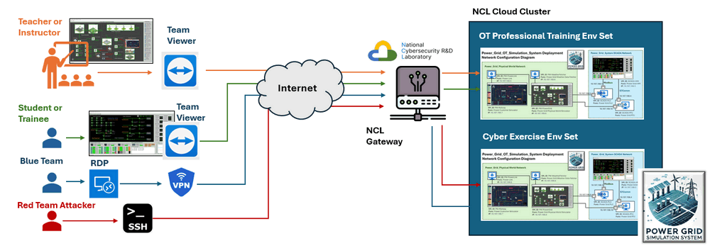

# Power Grid System Access Manual

This document will introduce the steps to remote access different VMs in a power grid system in the NCL cloud infrastructure. 


```
# Author:      Yuancheng Liu
# Created:     2025/02/18
# Version:     v_0.0.1
# DocNum:      Wiki_4_3
```

[TOC]

------

### Introduction

Currently we provide the hosting service within the NUS-NCL infrastructure, enabling users to access it remotely. Multiple instances of the system can be deployed based on specific user requirements for cybersecurity exercises or training sessions. To facilitate remote access, we offer multiple connectivity options to suit user preferences: TeamViewer or VPN + RDP for accessing VMs with a user interface, SSH Connection for lightweight and terminal-based access to standard VMs. The remote access diagram is shown below : 



To access the VMs in the cluster, you will be provide 3 type credentials: 

- **TeamViewer Peer ID and password** :  


------

### Remote login Windows VM use TeamViewer

We recommend you to login the physical world simulation VM, SCADA-HMI VM and Power Customer-VM with the TeamViewer. To download the team viewer client, follow this link:  https://www.teamviewer.com/apac/download/windows/. 


