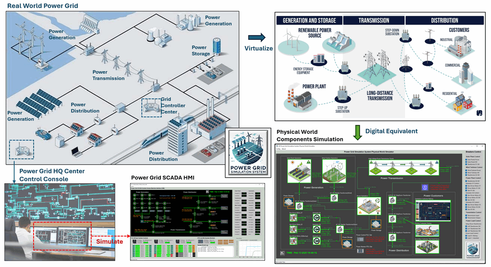
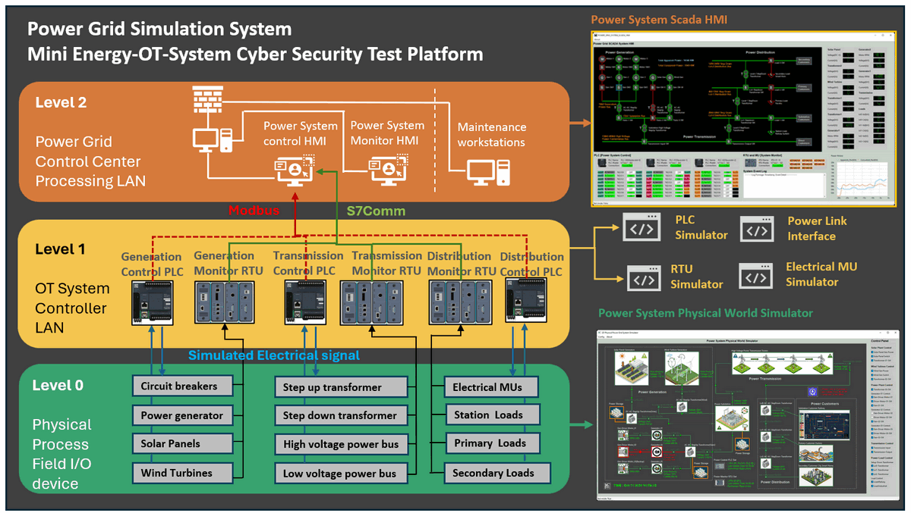

# Power_Grid_Simulation_System_Document [Wiki]

The **Mini OT Power Grid Simulation System** is a digital equivalent software platform designed to simulate the core operations of a hybrid power grid system, including hybrid power generation (natural gas power plants, solar power plants, and wind turbine farms), high-voltage power transmission and a three-level step-down power distribution system. The simulation integrates a SCADA system that incorporates PLCs for remote system control, RTUs and MUs for real-time data monitoring, and an HMI interface for operators to manage the grid. 

This repository provides a document Wiki for the "Power Grid Simulation System" Project, It includes an introduction, system design documentation, and user guidelines. **Please note that the repository does not include the program's source code.**


```python
# Author:      Yuancheng Liu
# Created:     2024/06/24
# Version:     v_0.2.0
# DocNum:      Wiki_0_0
```

**Table of Contents**

[TOC]

- [Power_Grid_Simulation_System_Document [Wiki]](#power-grid-simulation-system-document--wiki-)
    + [Project Design Purpose and Background](#project-design-purpose-and-background)
    + [Project Introduction](#project-introduction)
    + [System Structure](#system-structure)
    + [Project Document List](#project-document-list)
      - [[1] Introduction Documents](#-1--introduction-documents)
      - [[2] Software Design Documents](#-2--software-design-documents)
      - [[3] System Configuration Documents](#-3--system-configuration-documents)
      - [[4] System Usage Documents](#-4--system-usage-documents)
      - [[5] Cyber Security Case Study Documents](#-5--cyber-security-case-study-documents)
      - [[6] Reference Documents](#-6--reference-documents)

------

### Project Design Purpose and Background

The primary objective of this project is to develop a Power Grid Operational Technology (OT) digital twin/equivalent system that can be used for cyber-security related activities.

In the real world, an **electrical grid** (or **electricity network**) is an interconnected system for delivering electricity from producers to consumers. These grids consist of power stations for energy generation, electrical substations for stepping voltage up or down, high-voltage transmission systems for carrying power over long distances, and distribution systems that deliver electricity to end users. The key components of an electrical grid are divided into three main parts: **generation and storage**, **transmission**, and **distribution**.

This project aims to create a software-based digital twin that simulates both the energy delivery process among grid components and the operational flow between physical components, OT controllers, and SCADA software. An overview of the system is shown in the image below:



We Follow the [International Electrotechnical Commission](https://iec.ch/) IEC 61850, IEC 60617 standard when design and built the system, the system is a POC project and the real world energy system is more complex. This cyber range platform serves multiple purposes including cyber exercises, ICS professional training, OT security project R&D, testing and demonstration (Such as conducting cyber security exercises to demonstrate and assess the impact of various IT attacks on OT systems). 


------

### Project Introduction

The **Mini OT-Energy-System Cyber Security Test Platform** is a comprehensive software platform designed to simulate the essential operations of a small-scale hybrid power grid. The key objectives of this project will cover:

- **Cybersecurity Training & Exercises**: The platform will enable hands-on cybersecurity exercises, allowing professionals to explore and mitigate the effects of various cyber-attacks on OT systems.
- **OT System Simulation**: Simulating power grid operations with components that follow the [International Electrotechnical Commission](https://iec.ch/) standards, particularly IEC 61850 (communication networks and systems for power utility automation) and IEC 60617 (graphical symbols for diagrams), ensuring adherence to industry protocols.
- **Research & Development (R&D)**: Providing a research platform to explore and develop novel cybersecurity strategies, protocols, and solutions specifically for OT systems in the energy sector.
- **Training for ICS Professionals**: Offering a realistic environment for industrial control system (ICS) professionals to enhance their understanding of OT operations and cyber-attack scenarios in a controlled, risk-free setting.
- **R&D and Testing**: Facilitating the testing of new OT security tools and protocols, as well as demonstrating the impact of cyber-attacks on critical infrastructures, such as power generation and distribution networks.

This digital twin provides a dynamic environment for simulating power generation from multiple sources, including natural gas power plants, solar farms, and wind turbine farms. It also simulates high-voltage power transmission and a three-level step-down distribution system. The system overview is shown below:


At the core of the system is a SCADA (Supervisory Control and Data Acquisition) system, which integrates key components such as Programmable Logic Controllers (PLCs), Remote Terminal Units (RTUs), and Metering Units (MUs). These components work together to enable real-time data monitoring, control, and communication, while an intuitive Human-Machine Interface (HMI) allows operators to oversee and manage grid activities. The platform follows the IEC 61850 standard for power system communications, ensuring compatibility with modern power grid structures.

The system architecture consists of three primary modules:

- **2D Visualization Program**: Simulates the physical-world devices and components of the power grid, providing a clear visual representation of grid operations.
- **OT Field Controller Simulation**: Includes simulation programs for PLCs, sensors, Metering Units (MUs), and Remote Control Units (RTUs) that enable interaction between the grid’s physical elements and the control systems.
- **SCADA-HMI System**: Provides supervisory control and real-time monitoring of the simulated power grid, allowing for detailed oversight of grid performance and operations.

Beyond replicating traditional grid functionalities, the simulation also incorporates smart grid features. This includes automated detection of unusual situations, alerts, and adaptive generation-load balancing to emulate how modern power grids respond to disruptions and maintain system equilibrium.

> For the detail introduction of each components, refer to module introduction document: [Link]()


------

### System Structure

The simulation provides a modular, comprehensive approach to replicating real-world power generation, transmission, and distribution processes. It will integrate physical-world simulation with various control and monitoring units, including electrical metering units (MUs), programmable logic controllers (PLCs), remote terminal units (RTUs), and a SCADA-HMI interface. By offering full-spectrum emulation from Level 0 (physical field devices and sensors) to Level 2 (control center operations) as shown below, this platform creates a robust environment to simulate operational activities and vulnerabilities.



The platform consists of three primary components, each targeting a different level of OT system requirements:

- `OT Level 0`: A 2D simulation program representing the physical-world processes of a power grid, including energy generation from natural gas, solar, and wind sources, as well as the physical flow of electricity through transmission lines and distribution networks.
- `OT Level 1`: Simulation of power system controllers, including MU, PLC, and RTU functionalities, responsible for gathering, processing, and transmitting data from field devices to supervisory systems.
- `OT Level 2`: A fully integrated SCADA-HMI system that provides real-time visualization, monitoring, and control of the simulated power grid, ensuring seamless interaction with the OT environment.


------

### Project Document List

This section will list the document files in each Wiki folder

#### [1] Introduction Documents

- The introduction document of the project, papers and the presentation slides. 
- Folder : `1_Introduction_Doc`

| File Name                     | Wiki Index | Version | Description                                     | Doc Link                                               |
| ----------------------------- | ---------- | ------- | ----------------------------------------------- | ------------------------------------------------------ |
| `1_System_Introduction.md`    | Wiki_1_1   | v_0.2.0 | The project introduction and overview document. | [Link](1_Introduction_Doc/1_System_Introduction.md)    |
| `2_Product_Introduction.pptx` | Wiki_1_2   | v_0.1.5 | Product Introduction slides.                    | [Link](1_Introduction_Doc/2_Product_Introduction.pptx) |
|                               |            |         |                                                 |                                                        |

#### [2] Software Design Documents

- The document of the main system, subsystem, network structure and program. 
- Folder : `2_SystemDesign_Doc`

| File Name                          | Wiki Index | Version | Description                                                  | Doc Link                                                    |
| ---------------------------------- | ---------- | ------- | ------------------------------------------------------------ | ----------------------------------------------------------- |
| `1_System_Design.md`               | Wiki_2_1   | v_0.2.0 | The main system design introduction.                         | [Link](2_SystemDesign_Doc/1_System_Design.md)               |
| `2_PLC_Breakers_Control_Design.md` | Wiki_2_2   | v_0.2.0 | The program PLC simulator breakers control flow design introduction. | [Link](2_SystemDesign_Doc/2_PLC_Breakers_Control_Design.md) |
| `3_Network_Packet_Design.md`       | Wiki_2_3   | v_0.2.0 | lvl2 OT network communication design document.               | [Link](2_SystemDesign_Doc/3_Network_Packet_Design.md)       |
| `4_MU_RTU_Monitor_Design.md`       | Wiki_2_4   | v_0.2.0 | The MU-IED-RTU simulation work flow design introduction      | [Link](2_SystemDesign_Doc/4_MU_RTU_Monitor_Design.md)       |
|                                    |            |         |                                                              |                                                             |

#### [3] System Configuration Documents

- The document to setup the system in a environment. 
- Folder : `3_Configuration_Doc`

| File Name                       | Wiki Index | Version | Description                                                  | Doc Link                                                  |
| ------------------------------- | ---------- | ------- | ------------------------------------------------------------ | --------------------------------------------------------- |
| `1_System_Setup_Manual.md`      | Wiki_3_1   | v_0.2.0 | The system environment setup manual.                         | [Link](3_Configuration_Doc/1_System_Setup_Manual.md)      |
| `2_System_Deployment_Manual.md` | Wiki_3_1   | v_0.2.0 | Detailed instruction deployment manual to setup environment in network | [Link](3_Configuration_Doc/2_System_Deployment_Manual.md) |
|                                 |            |         |                                                              |                                                           |

#### [4] System Usage Documents

- The document to remote access and use the system.
- Folder : `4_UsageManual_Doc`

| File Name           | Wiki Index | Version | Description                     | Doc Link                                    |
| ------------------- | ---------- | ------- | ------------------------------- | ------------------------------------------- |
| `3_AccessManual.md` | Wiki_4_3   | v_0.2.0 | The system remote access manual | [Link](4_UsageManual_Doc/3_AccessManual.md) |
|                     |            |         |                                 |                                             |

#### [5] Cyber Security Case Study Documents

- The document about demo cyber attack by using the system
- Folder : `5_CaseStudy_Doc`

| File Name            | Wiki Index | Version | Description                                                  | Doc Link                                   |
| -------------------- | ---------- | ------- | ------------------------------------------------------------ | ------------------------------------------ |
| `1_CaseStudy_FDI.md` | Wiki_5_1   | v_0.2.0 | The false data injection attack case study introduction document | [Link](5_CaseStudy_Doc/1_CaseStudy_FDI.md) |
|                      |            |         |                                                              |                                            |

#### [6] Reference Documents 

- The technical documents, produce manual and papers used as reference to develop the system. 
- Folder : `reference`


------

> last edit by Liu Yuancheng (liu_yuan_cheng@hotmail.com) by 09/04/2025 if you have any question, please send me a message. 