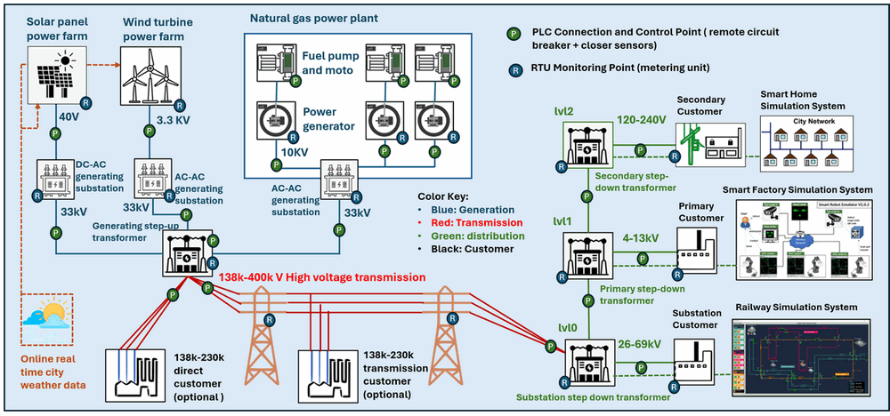

# Power_Grid_Simulation_System_Document

This repository provides a document Wiki for the "Power Grid Simulation System" Project, it includes introduction document, system design document and usage document. The program source code is **not** included this repository.

**Project Design Purpose and Background** : 

The primary objective of this project is to develop a Power Grid Operational Technology (OT) digital twin/equivalent system that can be used for cyber-security related activities.

In the real world, an **electrical grid** (or **electricity network**) is an interconnected network for electricity delivery from producers to consumers. Electrical grids consist of power stations, electrical substations to step voltage up or down, electric power transmission to carry power over long distances, and finally electric power distribution to customers. The key electric grid components include 3 main part: Generation and Storage, transmission and distribution. We want to create a software digital twin to simulate the both energy delivery sequence among different grid components operational and operational flow among the physical components, OT controllers and the SCADA software. The over view is shown below image

------

### Introduction

